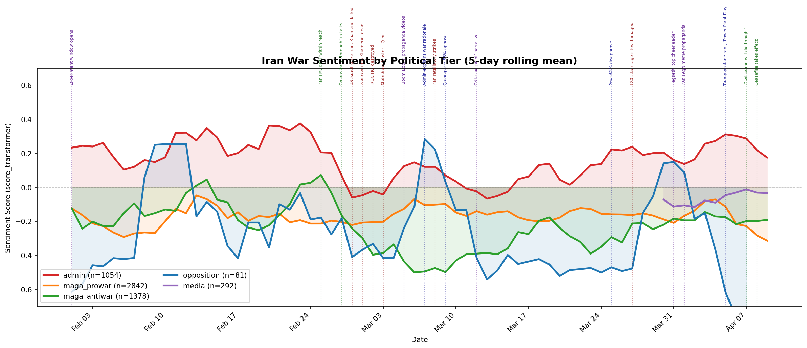
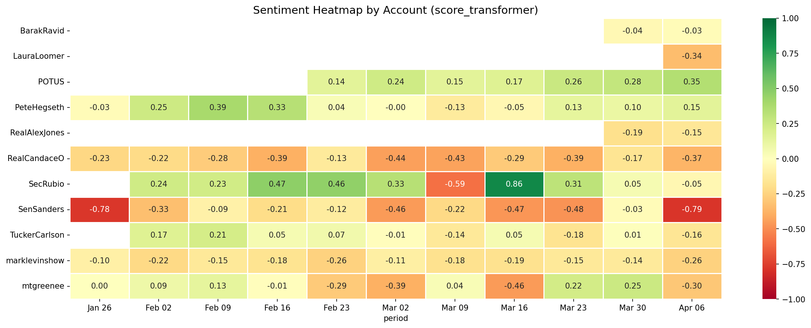

# iran-sentiment

Sentiment analysis of US political messaging during the 2026 Iran war
(Feb 1 -- Apr 10, 2026). Tracks how the Trump administration, MAGA
influencer ecosystem, opposition voices, and media covered 40 days of
sustained combat -- including the "MAGA civil war" split between pro-
and anti-war factions within Trump's own base.

## Key findings

**5,796 tweets** from 12 X/Twitter accounts across 5 political tiers,
plus **57,055 Truth Social replies** to 3 key Trump posts, scored with
both VADER (rule-based baseline) and RoBERTa
(`cardiffnlp/twitter-roberta-base-sentiment-latest`).

### The tier divergence is the story



Administration accounts (POTUS, SecRubio, PeteHegseth) are the **only
tier with net-positive sentiment** (+0.16 RoBERTa mean), maintaining a
consistently optimistic, triumphal frame throughout the conflict.
Every other tier is net-negative:

| Tier | RoBERTa mean | n |
|------|-------------|---|
| admin | +0.159 | 1,054 |
| media | -0.038 | 292 |
| maga_prowar | -0.196 | 2,842 |
| maga_antiwar | -0.224 | 1,378 |
| opposition | -0.297 | 81 |

The MAGA anti-war voices (Tucker Carlson, Candace Owens, Alex Jones,
MTG) score more negatively than the pro-war MAGA accounts (Levin,
Loomer), but both factions are net-negative -- the "pro-war" influencers
are more hawkish in framing but still more critical in tone than the
administration itself.

### Audience pushback visible in replies

A stratified 500-reply LLM stance classification on Trump's three most
significant Truth Social posts found:

- **~31-37% pro-war supportive** across all three posts
- **~18-26% anti-war opposition** (moral/political grounds)
- **~7-11% "betrayal" framing** ("voted 3x for you, losing me as a
  supporter") -- the within-MAGA civil war signal
- Sentiment turns **most negative** on "A whole civilisation will die
  tonight" (-0.34 mean) vs. the "Power Plant Day" escalation (-0.23)

### Per-account detail



Notable patterns:
- **@SecRubio** has the highest individual mean (+0.26) and the most
  volatile swings, spiking to +0.86 the week of Mar 9
- **@SenSanders** is the most negative account (-0.30) but VADER
  paradoxically scores him *positive* (+0.11) because anti-war language
  ("peace", "diplomacy", "humanity") is lexically positive -- a known
  VADER weakness for this domain
- **@TuckerCarlson** barely posts (~70 tweets) but crosses from positive
  to negative mid-conflict

## Methodology

### Data collection

- **X/Twitter**: v2 API, per-account JSONL caching, capped at 500
  tweets/account to control cost ($0.005/read)
- **Truth Social**: Authenticated API via `curl_cffi` (Cloudflare
  bypass), paginated reply collection for tracked posts
- **Window**: Feb 1 -- Apr 10, 2026 (with pre-war context events back
  to Jun 2025)

### Sentiment scoring

Three scorers run in order of cost:

1. **VADER** -- rule-based lexicon baseline. Fast but naive: can't
   distinguish "we destroyed their nuclear facility" (triumphant) from
   "destroyed" (negative lexical). Included as a baseline to demonstrate
   why lexicon-based sentiment fails on war rhetoric.
2. **RoBERTa** -- `cardiffnlp/twitter-roberta-base-sentiment-latest`,
   fine-tuned on Twitter text. The primary signal. Batched inference on
   CPU with memory checkpointing (the pipeline was designed for a mini
   PC with limited RAM).
3. **Claude Haiku** -- optional LLM-based scoring and stance
   classification. Used for the 500-reply stance sample, not the full
   dataset.

### Event overlay

24 key events are catalogued in `config/timeline.py` (military strikes,
diplomatic moments, polling, media events) and overlaid on all
time-series plots to correlate sentiment shifts with real-world triggers.

## Setup

Requires Python 3.11+.

```bash
python -m venv .venv
source .venv/bin/activate
pip install -e .
```

Copy `.env.example` to `.env` and fill in credentials:

```bash
cp .env.example .env
# Edit .env with your X API bearer token and (optionally)
# Truth Social credentials and Anthropic API key
```

## Usage

Everything runs through a single CLI:

```bash
python -m src.cli test          # verify X API credentials
python -m src.cli status        # show what's cached vs. missing
python -m src.cli collect       # collect X/Twitter data (respects cache)
python -m src.cli collect-truth # collect Truth Social posts
python -m src.cli collect-replies  # fetch replies to tracked Trump posts
python -m src.cli analyze       # score all cached data (VADER + RoBERTa)
python -m src.cli visualize     # regenerate all figures
python -m src.cli summary       # print stats tables
python -m src.cli event-study   # reply sentiment + event-window analysis
python -m src.cli run-all       # full pipeline
```

`collect` is incremental -- it skips accounts with cached JSONL files.
Pass `--force` to re-fetch. To add accounts or search terms, edit
`config/accounts.py` and rerun.

## Project structure

```
config/
  settings.py          # paths, budget caps, batch sizes, tier colors
  accounts.py          # X/Truth Social handles organized by tier
  timeline.py          # 24 key events for plot overlays
  tracked_posts.py     # specific Trump posts for reply analysis
src/
  cli.py               # Click CLI -- single entrypoint
  collectors/
    x_collector.py     # X API v2 with per-account JSONL caching
    truthsocial_collector.py  # Truth Social API + curl_cffi
  analysis/
    sentiment.py       # VADER + RoBERTa + optional Claude scoring
    event_study.py     # reply sentiment + event-window comparisons
  visualization/
    plots.py           # timeline, tier comparison, heatmap, search plots
data/                     # gitignored -- not included in repo
  raw/x/*.jsonl           # per-account tweet caches
  raw/truthsocial/*.jsonl # Truth Social posts + replies
  processed/*.parquet     # scored sentiment data
  processed/figures/*.png # generated plots
```

## Limitations

- **Small account sample**: 12 X accounts across 5 tiers. The tiers are
  illustrative, not representative -- expanding to more accounts per
  tier would improve statistical power.
- **VADER is misleading on war rhetoric**: included as a baseline to
  demonstrate the problem, not as a reliable signal. RoBERTa is the
  primary scorer.
- **RoBERTa score vs. label can disagree**: the weighted score is a
  continuous signal (good for aggregation), while the label is an
  argmax (good for categorical counts). See `sentiment.py` docstring.
- **Truth Social reply coverage**: the API may truncate very large
  reply trees. Coverage is validated per-post during collection.
- **No causal claims**: this is observational sentiment tracking, not
  causal inference. The event overlays show correlation, not causation.

## Cost

X API reads are $0.005/tweet. The full dataset (~5,800 tweets) cost
approximately $29. The 500-reply stance classification used Claude
Haiku tokens. Truth Social API access is free.
