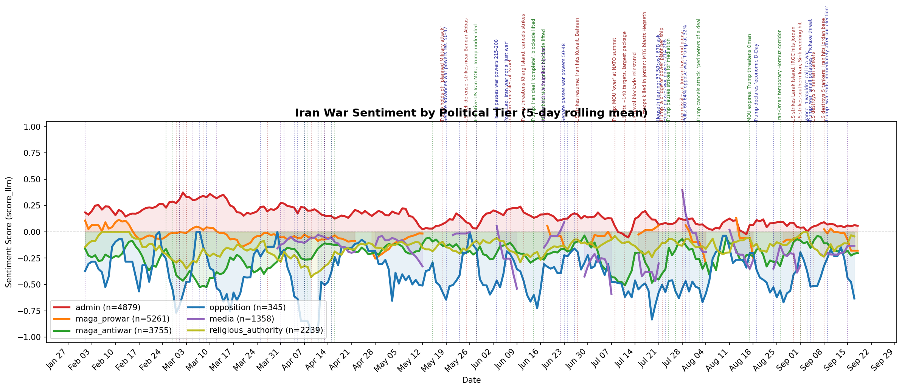
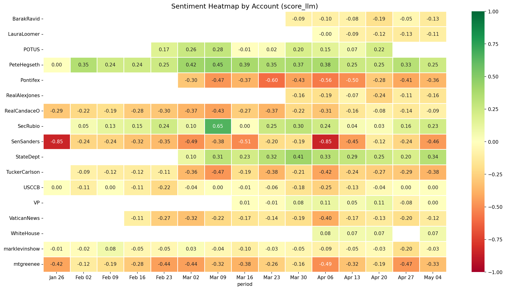

# iran-sentiment

Sentiment analysis of US political messaging during the 2026 Iran war
(Feb 1 -- Sep 18, 2026). Tracks the Trump administration, MAGA
influencers (both pro- and anti-war), the opposition, media, and the
Pope Leo XIV / Vatican moral axis across X and Truth Social, from a
month before the Feb 28 strikes through the Apr 8 ceasefire, the June
Islamabad deal and its July collapse, and the renewed strikes of
September.

X broadcaster data runs to 2026-09-18 (keyword searches are frozen at
May 12); the Truth Social layer -- Trump's feed and the reply-level
audience analysis -- runs through 2026-09-16. Nothing runs on a
schedule.

## Findings

19,605 posts from 17 X/Twitter accounts across 6 political tiers plus
4 keyword searches (a public-sentiment proxy, Feb-May only), plus 83,054 Truth Social
replies to 6 Trump posts (three from the April escalation, three from
the May-September deal-and-collapse cycle) and Trump's own Truth Social
feed from Apr 4 to Sep 16 (4,087 posts). Every post carries three scores: VADER
(lexicon baseline), RoBERTa (`cardiffnlp/twitter-roberta-base-sentiment-latest`,
valence), and a Claude Haiku stance score from -1.0 (anti-war) to +1.0
(pro-war). **Stance numbers below are the LLM score**; the RoBERTa
column is shown to make its miscalibration visible.

### Tier divergence



| Tier | LLM stance | RoBERTa | n |
|------|-----------:|--------:|--:|
| admin | +0.174 | +0.143 | 4,879 |
| maga_prowar | -0.056 | -0.199 | 5,261 |
| media | -0.119 | -0.032 | 1,358 |
| religious_authority | -0.180 | **+0.302** | 2,239 |
| maga_antiwar | -0.206 | -0.180 | 3,755 |
| search (public, Feb-May) | -0.326 | -0.346 | 1,768 |
| opposition | -0.376 | -0.303 | 345 |

The administration is the only net-pro-war tier. Everyone else is
net-negative, including the "pro-war" MAGA influencers: Levin and
Loomer are hawkish in framing but critical in tone, and land near zero
on stance. The MAGA split shows up as a 0.15-point gap between the
pro-war and anti-war influencer tiers.

### The religious sign flip

RoBERTa reads the Vatican tier as the *most positive* tier in the
dataset (+0.302) because faith-based anti-war language ("peace",
"mercy", "dialogue") is lexically positive. The LLM stance score puts
the same posts at -0.180, and @Pontifex at **-0.407 -- the most
anti-war account in the dataset** (RoBERTa: +0.330). Of 2,239
religious-tier posts, none were labelled pro-war. This tier is the
reason the project moved to LLM stance scoring; see the *Sentiment
scoring* section.

### Who the hawks actually are

The operational arms out-hawk the PR shop. @PeteHegseth (+0.295) and
@StateDept (+0.228) are the two most pro-war accounts; @POTUS is
+0.104 and @WhiteHouse only +0.051, even though RoBERTa had the White
House among the most positive accounts in the dataset (+0.331). @VP,
the lead negotiator from the Apr 11 Islamabad talks, sits at +0.034.

### Seven months: the administration talked itself down

LLM stance by tier across the four phases of the war (keyword searches
excluded; they end May 12):

| Tier | Feb 1 -- Apr 21<br>strikes, ceasefire | Apr 22 -- Jun 17<br>talks, MOU | Jun 18 -- Aug 17<br>collapse, blockade | Aug 18 -- Sep 18<br>expiry, strikes |
|---|--:|--:|--:|--:|
| admin | +0.235 | +0.181 | +0.108 | +0.073 |
| maga_prowar | -0.044 | -0.107 | -0.024 | -0.053 |
| media | -0.092 | -0.116 | -0.169 | -0.170 |
| religious_authority | -0.227 | -0.158 | -0.141 | -0.133 |
| maga_antiwar | -0.231 | -0.153 | -0.248 | -0.169 |
| opposition | -0.352 | -0.380 | -0.397 | -0.374 |
| posts | 9,419 | 4,088 | 2,614 | 1,716 |

- **The administration's own messaging got steadily less hawkish**, from
  +0.235 in the strike phase to +0.073 in the September strikes phase.
  The decline is in the diplomatic and presidential accounts, not the
  Pentagon: @StateDept +0.30 to +0.06, @SecRubio +0.16 to +0.04,
  @POTUS +0.14 to +0.04, while @PeteHegseth held between +0.24 and
  +0.34 throughout. By September the only consistently hawkish voice
  in the administration was the Secretary of War.
- **The opposition never moved.** @SenSanders sits between -0.35 and
  -0.40 in every phase.
- **The anti-war MAGA tier split internally.** @mtgreenee hardened
  (-0.32 to -0.37) and @RealAlexJones was most anti-war during the
  July collapse (-0.34), while @RealCandaceO softened from -0.29 to
  -0.16 after April.
- **The Vatican softened once the shooting paused and did not
  re-harden when it resumed**: @Pontifex -0.48 in the strike phase,
  -0.35 to -0.39 thereafter. Media (@BarakRavid) went the other way,
  -0.09 to -0.17.


### Per-account detail



- @SenSanders is the most anti-war non-Vatican voice (-0.376). VADER
  scores him positive because anti-war vocabulary is lexically
  positive.
- @LauraLoomer moves from RoBERTa -0.276 to LLM -0.067: her angry
  pro-war posts read as negative valence but near-neutral stance.
- @TuckerCarlson posts rarely (221 tweets in seven months) but is
  consistently anti-war from the strikes onward (-0.251).
- @mtgreenee is the most anti-war MAGA voice (-0.302).
- Blank weeks in the heatmap for Levin, Loomer, Alex Jones and the
  White House between May and July are a collection limit, not
  silence: see *Limitations*.

### Audience replies: six Trump posts, April to September

Every direct reply to six Trump Truth Social posts (83,054 replies,
97-99% of each post's reply count) scored with RoBERTa, plus a
stratified sample of 992 replies (50 per sentiment bucket per post)
classified by Claude Haiku into stance categories.

| Post | Date | Replies | RoBERTa mean | Critical | Supportive |
|---|---|--:|--:|--:|--:|
| "Power Plant Day" rant | Apr 5 | 23,656 | -0.225 | 54% | 24% |
| "Whole civilisation will die" | Apr 7 | 16,591 | -0.342 | 59% | 17% |
| Two-week ceasefire | Apr 7 | 16,808 | -0.303 | 58% | 19% |
| "Hold off on our planned Military attack" | May 18 | 8,800 | **-0.475** | **69%** | 11% |
| "The Deal with Iran is now complete" | Jun 14 | 12,609 | **+0.193** | 33% | **50%** |
| "Striking Iranian Targets near Hormuz" | Sep 1 | 4,590 | -0.246 | 53% | 21% |

- **Restraint was punished harder than escalation.** The May 18 post
  announcing a called-off attack is the most negative post in the
  dataset, and the only one where the most loyal accounts are the most
  negative (high-loyalty tier -0.51 vs low-loyalty -0.47; every other
  post has loyalists as the least negative). The Haiku sample shows why:
  it has the highest share of `pro_war_critical` replies of any post
  (12.7%), people angry that Trump did not strike.
- **The deal was the only thing the audience liked.** June 14 is the
  sole net-positive post, with the steepest loyalty gradient (+0.05 low
  to +0.40 high). Even so, a third of the sampled replies are anti-war
  in some form (betrayal 10.7%, opposition 15.3%, pro-Trump-anti-war
  10.0%).
- **Renewed strikes re-consolidated the base.** The September 1 strikes
  post has the highest `pro_war_supportive` share in the sample (56%)
  and the lowest betrayal share (4.7%), while its population-level
  RoBERTa mean matches the April "Power Plant Day" post.
- **The within-MAGA "betrayal" voice persists at 5-12% across all six
  posts** ("voted 3x for you, losing me as a supporter"), peaking on
  the April rant and the June deal, not on the strikes.

**Population-level stance (Sep 18).** The distilled stance model (see
*Stance-model experiments* below) scored every one of the 83,054
replies, so these are proportions of each post's whole audience, not a
sample:

| Post | Replies | Stance mean | Anti-war | Neutral | Pro-war | Loyalty low / mid / high |
|---|--:|--:|--:|--:|--:|---|
| "Power Plant Day" rant | 23,656 | -0.101 | 46% | 21% | 34% | -0.16 / -0.06 / +0.10 |
| "Whole civilisation will die" | 16,591 | **-0.167** | **51%** | 18% | 31% | -0.22 / -0.13 / +0.12 |
| Two-week ceasefire | 16,808 | +0.005 | 39% | 20% | 41% | -0.05 / +0.04 / +0.16 |
| "Hold off on our planned Military attack" | 8,800 | +0.062 | 39% | 17% | 45% | +0.03 / +0.08 / +0.16 |
| "The Deal with Iran is now complete" | 12,609 | +0.117 | 25% | 21% | **54%** | +0.03 / +0.16 / +0.28 |
| "Striking Iranian Targets near Hormuz" | 4,590 | **+0.164** | 28% | 20% | 52% | +0.10 / +0.19 / +0.30 |

- **Stance and tone diverge most on the May 18 post.** By valence it
  was the angriest post in the dataset (-0.48); by stance it is mildly
  pro-war (+0.06, 45% pro-war). The audience was furious *that Trump
  held off*, not that he had threatened to strike, which is what the
  Haiku sample's high `pro_war_critical` share had hinted.
- **Loyalty predicts hawkishness on every post, monotonically.** The
  valence reading had loyalists as the *most negative* group on May 18;
  in stance terms they are the most pro-war group on all six posts, and
  the only group net pro-war on the two April escalation posts.
- **The strikes post is the most pro-war of the six** (52% pro-war,
  28% anti), the June deal a close second. The April "civilisation will
  die" post remains the only one where anti-war replies are a majority.

The distilled model was trained on Haiku labels and inherits Haiku's
tendency to read angry hawkish text as anti-war (see the teacher check
below), so the pro-war shares here are, if anything, lower bounds.

Stance shares are from a bucket-balanced sample, so they describe the
spectrum of each post's replies, not population proportions; the
RoBERTa columns are the population numbers. RoBERTa's blind spots are
the same as on the broadcaster data: `pro_war_critical` replies read as
negative (-0.55) and `pro_trump_antiwar` replies read as positive
(+0.22).

## Methodology

### Data collection

- X/Twitter: v2 API, per-account JSONL caching, incremental refresh
  (each run appends only tweets newer than the latest cached one),
  capped at 500 tweets per account per run to control cost
  ($0.005/read). Long gaps are walked in two-week slices with the cap
  shared across slices, so a cap hit thins a fortnight rather than
  dropping months; the five most prolific accounts were sampled at 450
  for the May-September refresh.
- Keyword searches use `/search/recent`, which only reaches back 7
  days. Searches were refreshed on Apr 16 and May 12 and not since, so
  the search tier covers Feb 1 to May 12 with a gap from roughly Apr 20
  to May 5, and is excluded from the phase comparisons above.
- Truth Social: `curl_cffi` (Cloudflare bypass). Account feeds via the
  public API with an incremental, resume-safe refresh; replies via the
  authenticated v2 descendants endpoint after a one-time `ts-login`
  (Truth Social's new-device security-code check).
- Window: Feb 1 -- Sep 18, 2026 for accounts, with pre-war context
  events back to Jun 2025.

### Sentiment scoring

Three scorers, in order of cost:

1. VADER -- rule-based lexicon baseline. Can't distinguish "we
   destroyed their nuclear facility" (triumphant) from "destroyed"
   (negative lexical). Included to show why lexicon-based sentiment
   fails on war rhetoric.
2. RoBERTa -- `cardiffnlp/twitter-roberta-base-sentiment-latest`,
   fine-tuned on Twitter text. A valence signal, not a stance signal:
   it has a systematic positive bias on institutional language and
   sign-flips the religious tier. Batched CPU inference with memory
   checkpointing (the pipeline runs on a fanless mini PC).
3. Claude Haiku stance -- JSON-scored stance from -1.0 (anti-war) to
   +1.0 (pro-war), with an `off_topic` pre-filter. Run over the full
   dataset (100% coverage); the source of truth for every stance
   number in this README. Also used for the 500-reply stance sample.

### Event overlay

84 events are catalogued in `config/timeline.py` (military strikes,
diplomatic moments, polling, media events) and overlaid on time-series
plots. The first 36 cover the pre-war build-up through Apr 15; 48 more,
added Sep 2026 from a web-research pass with independent fact-checking,
cover May 12 -- Sep 15 (the Islamabad MOU of Jun 17, its collapse Jul 8,
expiry Aug 17, and the renewed strikes of September). Each event carries
an importance score; `EVENT_LABEL_MIN_IMPORTANCE` in settings controls
which get labelled on plots. Source URLs for the new events are in
`docs/timeline_candidates_2026-05-12_to_2026-09-15.json`. Data currently
ends May 12, so the later events are not yet plotted.

## Stance-model experiments (GPU, Sep 2026)

Can the per-post Haiku call be replaced by something that runs free on
the homelab's RTX 3080? Three one-shot Kubernetes Jobs (`k8s/README.md`),
all evaluated on the same per-tier held-out split against the Haiku
labels the dataset carries:

| Candidate | Pearson | MAE | Sign agreement | Sign flips |
|---|--:|--:|--:|--:|
| RoBERTa valence (`score_transformer`, the current quick-look scorer) | 0.28 | 0.45 | 38% | 14.9% |
| Qwen2.5-7B-Instruct, 4-bit, same prompt as Haiku (920 posts) | 0.47 | 0.38 | 49% | 9.7% |
| **RoBERTa-large fine-tuned on the Haiku labels** (3,893 posts) | **0.74** | **0.16** | **75%** | **5.2%** |

The distilled encoder is the clear winner: 7.5 minutes of training, then
83,000 replies in seconds. It is strongest exactly where the valence
model failed, 0.90 Pearson and 0.4% flips on the religious tier. The
open 7B model with the Claude prompt is only modestly better than
valence and not a Haiku substitute.

**But the teacher has a blind spot.** A check of 497 posts, 71 per tier,
relabelled by Claude Opus 5 shows Haiku and Opus agreeing on most tiers
(0.76 to 0.78 Pearson and 82 to 90% sign agreement on admin, anti-war
MAGA and religious) but not on the pro-war tier: 0.34 Pearson and 24%
sign flips. Haiku scores Mark Levin's vicious attacks on the anti-war
right as anti-war (-0.85) because of their tone; Opus reads them as
hawkish (+0.60). Haiku also marks praise of peace as pro-war (a USCCB
post commending the agreement at +0.70). This is RoBERTa's failure mode
in weaker form, so the `maga_prowar` averages in this README are likely
too low, and a model distilled from Haiku inherits the bias. The next
step is relabelling with Opus 5 and distilling from that.

Artifacts: `data/models/stance_distilled/` (model, holdout predictions,
metrics), `data/processed/teacher_check_claude-opus-5.*`,
`data/processed/local_llm_Qwen_Qwen2.5-7B-Instruct.*`.

## Setup

Requires Python 3.11+.

```bash
python -m venv .venv
source .venv/bin/activate
pip install -e .
```

Credentials live in `secrets.env`, committed encrypted with sops + age
(homelab-infra `docs/secrets.md`; the private key is on dkbl1). Decrypt it
into the working `.env` the code reads:

```bash
sops -d secrets.env > .env          # on dkbl1, SOPS_AGE_KEY_FILE=~/.config/homelab-infra/age.key
sops secrets.env                    # edit a value in place; then re-run the line above
sops -e .env > secrets.env          # or edit .env and re-encrypt; commit secrets.env
```

Without the key, copy `.env.example` to `.env` and fill in credentials:

```bash
cp .env.example .env
# Edit .env with your X API bearer token and (optionally)
# Truth Social credentials and Anthropic API key
```

## Usage

Everything runs through a single CLI:

```bash
python -m src.cli test          # verify X API credentials
python -m src.cli status        # show what's cached vs. missing
python -m src.cli collect       # incremental X fetch (appends new tweets only)
python -m src.cli collect-truth # incremental Truth Social feed refresh
python -m src.cli ts-login      # one-time login (security code) -> token in .env
python -m src.cli collect-replies  # fetch replies to tracked Trump posts (needs token)
python -m src.cli analyze       # score all cached data (VADER + RoBERTa)
python -m src.cli analyze --llm # add Claude stance scores (restart-safe)
python -m src.cli visualize     # regenerate all figures
python -m src.cli summary --score score_llm   # stance tables
python -m src.cli event-study   # reply sentiment + event-window analysis
python -m src.cli run-all       # full pipeline
```

`collect` is incremental at the per-account level: each rerun fetches
only tweets newer than the latest cached `created_at` and appends.
Pass `--force` to re-fetch an account's whole window. To add accounts
or search terms, edit `config/accounts.py` and rerun. `analyze --llm`
skips posts that already have a stance score, so re-running after a
collect only spends tokens on new posts.

## Project structure

```
config/
  settings.py          # paths, budget caps, batch sizes, tier colors
  accounts.py          # X/Truth Social handles organized by tier
  timeline.py          # 84 key events (Jun 2025 - Sep 2026) for plot overlays
  tracked_posts.py     # specific Trump posts for reply analysis
src/
  cli.py               # Click CLI -- single entrypoint
  collectors/
    x_collector.py     # X API v2, per-account JSONL cache, incremental fetch
    truthsocial_collector.py  # Truth Social API + curl_cffi
  analysis/
    sentiment.py       # VADER + RoBERTa + Claude stance scoring
    event_study.py     # reply sentiment + event-window comparisons
  visualization/
    plots.py           # timeline, tier comparison, heatmap, search plots
data/                     # gitignored -- not included in repo
  raw/x/*.jsonl           # per-account tweet caches
  raw/truthsocial/*.jsonl # Truth Social posts + replies
  processed/*.parquet     # scored sentiment data
  processed/figures/*.png # generated plots
docs/figures/             # the LLM-stance figures referenced above
```

## Limitations

- 17 X accounts across 6 tiers is illustrative, not representative.
  The opposition tier is a single account (124 posts).
- VADER and RoBERTa are valence proxies. Any stance comparison across
  tiers must use `score_llm`; the RoBERTa number for the religious
  tier is actively misleading.
- X's user-timeline endpoint only returns an account's most recent
  ~3,200 tweets. The September refresh came four months after the
  last one, so for the most prolific accounts the early part of that
  gap is unrecoverable: no posts before Jun 20 for @marklevinshow,
  Jul 4 for @LauraLoomer, Jul 17 for @WhiteHouse and Jul 31 for
  @RealAlexJones. Their phase-two numbers rest on April and early May
  only. The remaining 13 accounts are continuous.
- The five most prolific accounts are sampled (450 per refresh spread
  across two-week slices), not exhaustive, from May 10 on.
- Search coverage stops at May 12 and has a gap in late April (see
  *Data collection*).
- Truth Social's API may truncate large reply trees. Coverage is
  validated per-post during collection.
- This is observational sentiment tracking, not causal inference. Event
  overlays show correlation, not causation.

## Cost

X API reads cost $0.005/tweet. Collection through Apr 20 (9,477
tweets) cost about $47; the May 10/12 refresh added roughly 4,500
tweets, about $22; the Sep 18 refresh read 5,631 tweets, about $28. LLM stance scoring of the full dataset ran
about $15 on Claude Haiku through April; the May 12 pass over the
~4,500 new posts was about $2 (672k input + 267k output tokens on
Haiku 4.5, from the console usage page). Truth Social API access is
free.
