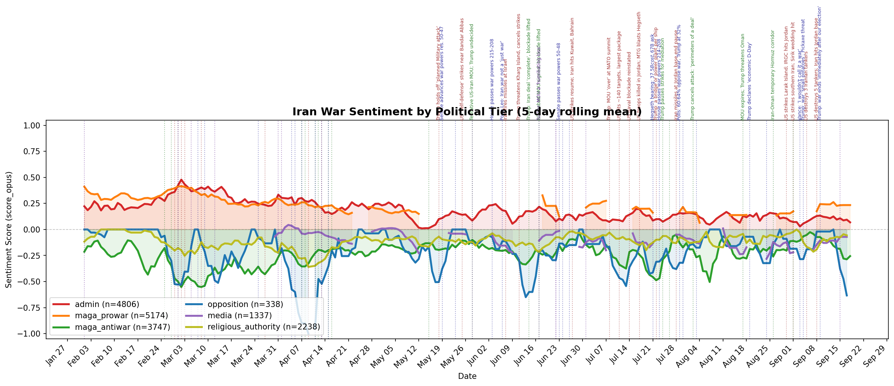
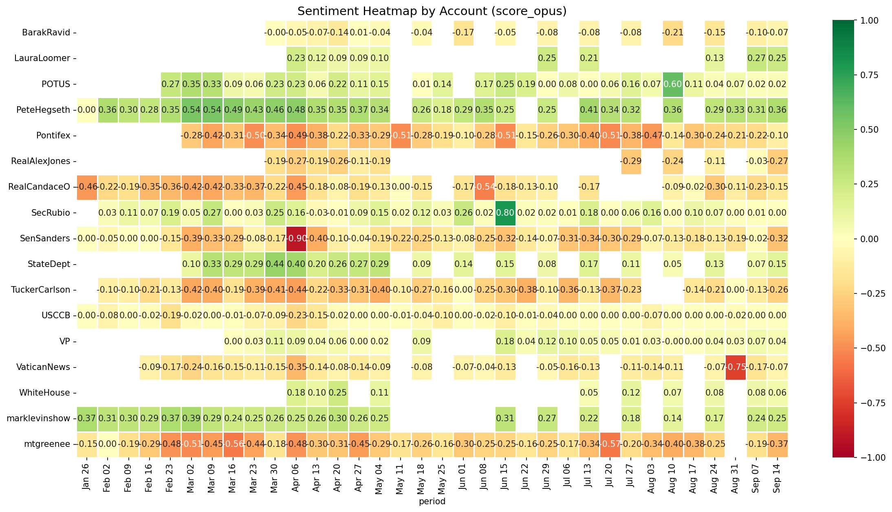

# iran-sentiment

Sentiment analysis of US political messaging during the 2026 Iran war
(Feb 1 -- Sep 18, 2026). Tracks the Trump administration, MAGA
influencers (both pro- and anti-war), the opposition, media, and the
Pope Leo XIV / Vatican moral axis across X and Truth Social, from a
month before the Feb 28 strikes through the Apr 8 ceasefire, the June
Islamabad deal and its July collapse, and the renewed strikes of
September.

X broadcaster data runs to 2026-09-18 (keyword searches are frozen at
May 12); the Truth Social layer -- Trump's feed and the reply-level
audience analysis -- runs through 2026-09-16. Nothing runs on a
schedule.

## Findings

19,605 posts from 17 X/Twitter accounts across 6 political tiers plus
4 keyword searches (a public-sentiment proxy, Feb-May only), plus 83,054 Truth Social
replies to 6 Trump posts (three from the April escalation, three from
the May-September deal-and-collapse cycle) and Trump's own Truth Social
feed from Apr 4 to Sep 16 (4,087 posts). Every post carries four scores: VADER (lexicon baseline), RoBERTa
(`cardiffnlp/twitter-roberta-base-sentiment-latest`, valence), a Claude
Haiku 4.5 stance score, and a Claude Opus 5 stance score from -1.0
(anti-war) to +1.0 (pro-war), the last obtained by relabelling every
post through the Batch API after a teacher check showed Haiku misreading
the pro-war tier (see *Stance-model experiments*). **Stance numbers
below are the Opus score**; Haiku and RoBERTa are shown to make their
miscalibrations visible.

### Tier divergence



| Tier | Opus stance | Haiku stance | RoBERTa | n |
|------|-----------:|-------------:|--------:|--:|
| maga_prowar | **+0.247** | -0.056 | -0.199 | 5,174 |
| admin | +0.211 | +0.175 | +0.143 | 4,806 |
| media | -0.062 | -0.120 | -0.032 | 1,337 |
| religious_authority | -0.137 | -0.180 | **+0.302** | 2,238 |
| search (public, Feb-May) | -0.143 | -0.325 | -0.346 | 1,765 |
| opposition | -0.199 | -0.384 | -0.303 | 338 |
| maga_antiwar | -0.234 | -0.206 | -0.180 | 3,747 |

Two net-pro-war tiers, and the pro-war influencers edge out the
administration itself. Everyone else is net-negative, with the anti-war
MAGA voices now the most anti-war tier in the dataset, ahead of the
opposition. The MAGA split is 0.48 points wide, three times what the
Haiku labels showed.

### The pro-war tier was mislabelled, twice

Both cheap scorers put Mark Levin and Laura Loomer on the anti-war side
of zero. RoBERTa does it because their posts are vicious in tone; Haiku
does it for the same reason in weaker form, scoring Levin's attacks on
"Qatarlson" and "genocidal regimes" at -0.85 where Opus reads them as
+0.60. On the whole dataset the two teachers agree well everywhere
except this tier: 0.35 Pearson and 21% opposite-sign labels on
`maga_prowar`, against 0.76 to 0.89 and under 5% flips on admin,
anti-war MAGA and religious posts. Corrected, @marklevinshow is +0.281
and @LauraLoomer +0.150: the pro-war influencers are hawks, full stop.

### The religious sign flip

RoBERTa reads the Vatican tier as the *most positive* tier in the
dataset (+0.302) because faith-based anti-war language ("peace",
"mercy", "dialogue") is lexically positive. Opus puts the same posts at
-0.137, and @Pontifex at **-0.310, tied with @mtgreenee as the most
anti-war account in the dataset**. Of 2,238 religious-tier posts, none
were labelled pro-war by either Claude model. This tier is the reason
the project moved to LLM stance scoring in the first place.

### Who the hawks actually are

The operational arms out-hawk the PR shop, and one radio host out-hawks
most of the cabinet. @PeteHegseth (+0.373) is the most pro-war account,
then @marklevinshow (+0.281), @StateDept (+0.240), @POTUS (+0.149),
@LauraLoomer (+0.150), @WhiteHouse (+0.104), @SecRubio (+0.080) and
@VP (+0.063).

### Seven months: the administration talked itself down, the influencers didn't

Opus stance by tier across the four phases of the war (keyword searches
excluded; they end May 12):

| Tier | Feb 1 -- Apr 21<br>strikes, ceasefire | Apr 22 -- Jun 17<br>talks, MOU | Jun 18 -- Aug 17<br>collapse, blockade | Aug 18 -- Sep 18<br>expiry, strikes |
|---|--:|--:|--:|--:|
| admin | +0.280 | +0.205 | +0.137 | +0.115 |
| maga_prowar | +0.272 | +0.173 | +0.225 | +0.217 |
| media | -0.049 | -0.044 | -0.100 | -0.106 |
| religious_authority | -0.180 | -0.110 | -0.108 | -0.101 |
| opposition | -0.222 | -0.164 | -0.223 | -0.158 |
| maga_antiwar | -0.280 | -0.175 | -0.233 | -0.148 |
| posts | 9,348 | 4,035 | 2,576 | 1,681 |

- **The administration's own messaging got steadily less hawkish**, from
  +0.280 in the strike phase to +0.115 in the September strikes phase.
  The decline is in the diplomatic and presidential accounts, not the
  Pentagon: @StateDept +0.31 to +0.11, @POTUS +0.20 to +0.07, @SecRubio
  +0.10 to +0.03, while @PeteHegseth held between +0.31 and +0.42.
- **The pro-war influencers did not follow.** They started level with
  the administration and stayed there, so from the July collapse on
  they were the more hawkish voice: +0.22 against the administration's
  +0.12 to +0.14. @LauraLoomer's lowest phase was the negotiation
  window, when she was attacking the deal rather than Iran.
- **Everyone anti-war softened once the shooting paused and did not
  fully re-harden**: anti-war MAGA -0.28 to -0.15, the Vatican -0.18 to
  -0.10, @SenSanders -0.22 to -0.16. Only media (@BarakRavid) drifted
  the other way, -0.05 to -0.11.

### Trump's own feed did not soften

The X series above samples @POTUS at 789 posts, only 65 of them about
Iran. Trump's Truth Social feed is the presidential voice at full
fidelity: 4,087 posts from Apr 4 to Sep 16, scored with the Opus-taught
model, 293 of them naming Iran, Hormuz or the regime.

| Phase | Trump TS, Iran posts | Trump TS, all posts | X @POTUS, all posts |
|---|--:|--:|--:|
| Feb 1 -- Apr 21 | +0.518 (n=76) | +0.168 | +0.202 |
| Apr 22 -- Jun 17 | +0.436 (n=82) | +0.111 | +0.139 |
| Jun 18 -- Aug 17 | +0.413 (n=85) | +0.099 | +0.099 |
| Aug 18 -- Sep 18 | +0.453 (n=50) | +0.097 | +0.072 |

When Trump posts about Iran he is as hawkish in September as in the
strike phase, around +0.45. The decline in his accounts' overall
average is composition: Iran became a smaller share of what he posts
about, not a softer one. The administration that talked itself down is
the agencies and the staff accounts (State, the White House, Rubio),
not the president's own Iran messaging, and not the Pentagon.

### Per-account detail



- @mtgreenee (-0.317) and @Pontifex (-0.310) are the most anti-war
  accounts; @TuckerCarlson and @RealCandaceO follow at -0.244.
- @SenSanders lands at -0.199 under Opus against -0.384 under Haiku:
  much of his output is procedural (war powers votes, hearings) and Opus
  reads it as neutral where Haiku read it as opposition.
- @TuckerCarlson posts rarely (221 tweets in seven months) but is
  consistently anti-war from the strikes onward.
- Blank weeks in the heatmap for Levin, Loomer, Alex Jones and the
  White House between May and July are a collection limit, not
  silence: see *Limitations*.

### Audience replies: six Trump posts, April to September

Every direct reply to six Trump Truth Social posts (83,054 replies,
97-99% of each post's reply count) scored with RoBERTa, plus a
stratified sample of 992 replies (50 per sentiment bucket per post)
classified by Claude Haiku into stance categories.

| Post | Date | Replies | RoBERTa mean | Critical | Supportive |
|---|---|--:|--:|--:|--:|
| "Power Plant Day" rant | Apr 5 | 23,656 | -0.225 | 54% | 24% |
| "Whole civilisation will die" | Apr 7 | 16,591 | -0.342 | 59% | 17% |
| Two-week ceasefire | Apr 7 | 16,808 | -0.303 | 58% | 19% |
| "Hold off on our planned Military attack" | May 18 | 8,800 | **-0.475** | **69%** | 11% |
| "The Deal with Iran is now complete" | Jun 14 | 12,609 | **+0.193** | 33% | **50%** |
| "Striking Iranian Targets near Hormuz" | Sep 1 | 4,590 | -0.246 | 53% | 21% |

- **Restraint was punished harder than escalation.** The May 18 post
  announcing a called-off attack is the most negative post in the
  dataset, and the only one where the most loyal accounts are the most
  negative (high-loyalty tier -0.51 vs low-loyalty -0.47; every other
  post has loyalists as the least negative). The Haiku sample shows why:
  it has the highest share of `pro_war_critical` replies of any post
  (12.7%), people angry that Trump did not strike.
- **The deal was the only thing the audience liked.** June 14 is the
  sole net-positive post, with the steepest loyalty gradient (+0.05 low
  to +0.40 high). Even so, a third of the sampled replies are anti-war
  in some form (betrayal 10.7%, opposition 15.3%, pro-Trump-anti-war
  10.0%).
- **Renewed strikes re-consolidated the base.** The September 1 strikes
  post has the highest `pro_war_supportive` share in the sample (56%)
  and the lowest betrayal share (4.7%), while its population-level
  RoBERTa mean matches the April "Power Plant Day" post.
- **The within-MAGA "betrayal" voice persists at 5-12% across all six
  posts** ("voted 3x for you, losing me as a supporter"), peaking on
  the April rant and the June deal, not on the strikes.

**Population-level stance (Sep 19).** The distilled stance model (see
*Stance-model experiments* below) scored every one of the 83,054
replies, so these are proportions of each post's whole audience, not a
sample. Three generations of the scorer are shown because the teacher
matters far more than the student:

| Post | Replies | RoBERTa on Haiku | DeBERTa on Haiku | **DeBERTa on Opus** | Anti-war | Pro-war | Loyalty low / mid / high |
|---|--:|--:|--:|--:|--:|--:|---|
| "Power Plant Day" rant | 23,656 | -0.101 | -0.134 | **+0.042** | 37% | 46% | +0.01 / +0.06 / +0.18 |
| "Whole civilisation will die" | 16,591 | -0.167 | -0.201 | **-0.000** | 40% | 48% | -0.03 / +0.02 / +0.20 |
| Two-week ceasefire | 16,808 | +0.005 | -0.010 | **+0.197** | 25% | 61% | +0.16 / +0.22 / +0.30 |
| "Hold off on our planned Military attack" | 8,800 | +0.062 | +0.040 | **+0.234** | 26% | 61% | +0.21 / +0.24 / +0.31 |
| "The Deal with Iran is now complete" | 12,609 | +0.117 | +0.081 | **+0.213** | 18% | 64% | +0.18 / +0.23 / +0.32 |
| "Striking Iranian Targets near Hormuz" | 4,590 | +0.164 | +0.166 | **+0.312** | 21% | 69% | +0.24 / +0.35 / +0.45 |

- **The audience is more hawkish than any earlier scorer said.** Under
  the Opus-taught model no post is net anti-war; four of six have a
  pro-war majority, and even the April "civilisation will die" post,
  the one the NYT reported as majority-critical, splits 48% pro-war to
  40% anti. Swapping the student (RoBERTa to DeBERTa, both on Haiku
  labels) moved nothing; swapping the teacher moved every post by 0.15
  to 0.20 in the pro-war direction. The Haiku-taught numbers were the
  same tone-as-stance error the teacher check found on Mark Levin,
  applied to an audience that is angry and hawkish at once.
- **Stance and tone still diverge most on May 18.** The angriest post by
  valence (-0.48) is one of the most pro-war by stance (+0.23, 61%
  pro-war): the audience was furious *that Trump held off*.
- **Loyalty predicts hawkishness monotonically on every post**, and the
  September strikes post is the most pro-war audience of the war, 69%,
  with the most loyal accounts at +0.45.
- **The only posts where the anti-war share reaches 40%** are the two
  April escalation posts, before the ceasefire, when the "voted 3x for
  you" betrayal voice was loudest.

**Domain shift, measured.** The model was trained on broadcaster posts
and applied to replies, a different register, so the 959 sampled replies
were relabelled by Opus directly (about $2). Against those, the reply
scores reproduce Opus at 0.71 Pearson with 13% opposite-sign labels,
against 0.88 and 2% on posts. The error runs pro-war: on the sample the
model calls 59% of replies pro-war where Opus calls 51%, and its mean is
+0.20 to Opus's +0.16. So the population shares above are inflated by
roughly five to ten points, and the honest reading is "about half of
Trump's audience replies are pro-war, a quarter to a third anti-war",
still hawkish, still nothing like the majority-critical picture the
valence scores gave. The fix, a retrain that includes the labelled
replies, is queued.

Stance shares are from a bucket-balanced sample, so they describe the
spectrum of each post's replies, not population proportions; the
RoBERTa columns are the population numbers. RoBERTa's blind spots are
the same as on the broadcaster data: `pro_war_critical` replies read as
negative (-0.55) and `pro_trump_antiwar` replies read as positive
(+0.22).

## Methodology

### Data collection

- X/Twitter: v2 API, per-account JSONL caching, incremental refresh
  (each run appends only tweets newer than the latest cached one),
  capped at 500 tweets per account per run to control cost
  ($0.005/read). Long gaps are walked in two-week slices with the cap
  shared across slices, so a cap hit thins a fortnight rather than
  dropping months; the five most prolific accounts were sampled at 450
  for the May-September refresh.
- Keyword searches use `/search/recent`, which only reaches back 7
  days. Searches were refreshed on Apr 16 and May 12 and not since, so
  the search tier covers Feb 1 to May 12 with a gap from roughly Apr 20
  to May 5, and is excluded from the phase comparisons above.
- Truth Social: `curl_cffi` (Cloudflare bypass). Account feeds via the
  public API with an incremental, resume-safe refresh; replies via the
  authenticated v2 descendants endpoint after a one-time `ts-login`
  (Truth Social's new-device security-code check).
- Window: Feb 1 -- Sep 18, 2026 for accounts, with pre-war context
  events back to Jun 2025.

### Sentiment scoring

Three scorers, in order of cost:

1. VADER -- rule-based lexicon baseline. Can't distinguish "we
   destroyed their nuclear facility" (triumphant) from "destroyed"
   (negative lexical). Included to show why lexicon-based sentiment
   fails on war rhetoric.
2. RoBERTa -- `cardiffnlp/twitter-roberta-base-sentiment-latest`,
   fine-tuned on Twitter text. A valence signal, not a stance signal:
   it has a systematic positive bias on institutional language and
   sign-flips the religious tier. Batched CPU inference with memory
   checkpointing (the pipeline runs on a fanless mini PC).
3. Claude Haiku stance -- JSON-scored stance from -1.0 (anti-war) to
   +1.0 (pro-war), with an `off_topic` pre-filter. Run over the full
   dataset (100% coverage). Good on most tiers but reads angry hawkish
   posts as anti-war (see *Stance-model experiments*).
4. Claude Opus 5 stance -- the same prompt, verbatim, at low effort,
   over every labelled post through the Message Batches API (half
   price). The stance of record for every number in this README.

### Event overlay

84 events are catalogued in `config/timeline.py` (military strikes,
diplomatic moments, polling, media events) and overlaid on time-series
plots. The first 36 cover the pre-war build-up through Apr 15; 48 more,
added Sep 2026 from a web-research pass with independent fact-checking,
cover May 12 -- Sep 15 (the Islamabad MOU of Jun 17, its collapse Jul 8,
expiry Aug 17, and the renewed strikes of September). Each event carries
an importance score; `EVENT_LABEL_MIN_IMPORTANCE` in settings controls
which get labelled on plots. Source URLs for the new events are in
`docs/timeline_candidates_2026-05-12_to_2026-09-15.json`. Data currently
ends May 12, so the later events are not yet plotted.

## Stance-model experiments (GPU, Sep 2026)

Can the per-post Haiku call be replaced by something that runs free on
the homelab's RTX 3080? Three one-shot Kubernetes Jobs (`k8s/README.md`),
all evaluated on the same per-tier held-out split against the Haiku
labels the dataset carries:

| Candidate | Pearson | MAE | Sign agreement | Sign flips |
|---|--:|--:|--:|--:|
| RoBERTa valence (`score_transformer`, the current quick-look scorer) | 0.28 | 0.45 | 38% | 14.9% |
| Qwen2.5-7B-Instruct, 4-bit, same prompt as Haiku (920 posts) | 0.47 | 0.38 | 49% | 9.7% |
| Qwen3-8B, 4-bit, thinking off, same prompt (920 posts) | 0.48 | 0.38 | 63% | 8.8% |
| Qwen3-8B, 4-bit, thinking on, 1,024-token budget (363 of 400 posts parsed) | 0.59 | 0.32 | 68% | 5.2% |
| RoBERTa-large fine-tuned on the Haiku labels (3,893 posts) | 0.75 | 0.15 | 78% | 4.9% |
| DeBERTa-v3-large fine-tuned on the Haiku labels (3,893 posts) | 0.79 | 0.14 | 78% | 4.1% |
| **DeBERTa-v3-large fine-tuned on the Opus labels** (3,881 posts, vs Opus) | **0.88** | **0.11** | 78% | **2.1%** |
| Full recipe sweep on the Opus labels: six RoBERTa variants 0.81 to 0.87, DeBERTa 256-token winner **0.869 +/- 0.011** over 5 folds | | | | |

The distilled encoder is the clear winner: 7.5 minutes of training, then
83,000 replies in a few minutes. A recipe sweep put six RoBERTa variants between 0.71 and 0.75
Pearson, and DeBERTa-v3-large (fit with 8-bit AdamW and gradient
checkpointing to fit the 10 GB card) at 0.79. The winner cross-validates
at **0.79 Pearson (5 folds, spread 0.003)** with 78% sign agreement and
4.5% flips. Architecture bought four points; the rest of the gap to a
perfect reproduction is the labels' own noise (Haiku agrees with Opus 5 at
only 0.64), which is what the Opus relabel below addresses. It is strongest exactly where the valence
model failed, 0.90 Pearson and 0.4% flips on the religious tier. The
open 7B/8B models with the Claude prompt are only modestly better than
valence and not a Haiku substitute; the 2025 generation (Qwen3) fixes
many sign errors (63% agreement vs 49%) but its correlation with the
teacher is unchanged, and it is weakest on the admin tier (0.18).
Letting it reason first lifts it to 0.59 with 5% flips, at a price:
9% of answers never reached JSON inside the token budget and 400 posts
took 2.6 hours, so it is neither accurate enough to replace the
distilled model nor fast enough to score 83,000 replies.

**The relabel.** Every labelled post was re-scored by Claude Opus 5
through the Batch API (19,405 of 19,457 parsed, about $31). Retrained on
those labels, the same DeBERTa recipe reproduces its teacher at 0.88
Pearson with 2.1% flips, against 0.79 and 4.1% on Haiku's: the Opus
labels are simply more self-consistent, so the "ceiling is the labels"
diagnosis was right. Per tier the Opus-taught model reaches 0.90 on
admin, 0.91 on religious and 0.82 on the pro-war tier where the
Haiku-taught one had its second-weakest result. On the same held-out
rows, RoBERTa valence agrees with Opus stance at 0.06 Pearson, which is
to say not at all. Rerunning the whole recipe sweep on the Opus labels moved every recipe
up by about a tenth and kept the ranking: DeBERTa-v3-large at 256 tokens
won at 0.876 and cross-validates at 0.869 +/- 0.011 with 2.4% flips. Its
full-label fit is `data/models/stance_distilled_final_score_opus/`, the
reply scorer of record (`score_opus_distilled`).

**Why the teacher had to change.** A check of 497 posts, 71 per tier,
relabelled by Claude Opus 5 shows Haiku and Opus agreeing on most tiers
(0.76 to 0.78 Pearson and 82 to 90% sign agreement on admin, anti-war
MAGA and religious) but not on the pro-war tier: 0.34 Pearson and 24%
sign flips. Haiku scores Mark Levin's vicious attacks on the anti-war
right as anti-war (-0.85) because of their tone; Opus reads them as
hawkish (+0.60). Haiku also marks praise of peace as pro-war (a USCCB
post commending the agreement at +0.70). This is RoBERTa's failure mode
in weaker form, so the `maga_prowar` averages in this README are likely
too low, and a model distilled from Haiku inherits the bias. The next
step is relabelling with Opus 5 and distilling from that.

Artifacts: `data/models/stance_distilled*/` (models, holdout predictions,
metrics), `data/models/sweep*/`, `data/processed/truthsocial_trump_stance.parquet`, `data/processed/teacher_check_claude-opus-5.*`,
`data/processed/local_llm_Qwen_*.*`.

## Setup

Requires Python 3.11+.

```bash
python -m venv .venv
source .venv/bin/activate
pip install -e .
```

Credentials live in `secrets.env`, committed encrypted with sops + age
(homelab-infra `docs/secrets.md`; the private key is on dkbl1). Decrypt it
into the working `.env` the code reads:

```bash
sops -d secrets.env > .env          # on dkbl1, SOPS_AGE_KEY_FILE=~/.config/homelab-infra/age.key
sops secrets.env                    # edit a value in place; then re-run the line above
sops -e .env > secrets.env          # or edit .env and re-encrypt; commit secrets.env
```

Without the key, copy `.env.example` to `.env` and fill in credentials:

```bash
cp .env.example .env
# Edit .env with your X API bearer token and (optionally)
# Truth Social credentials and Anthropic API key
```

## Usage

Everything runs through a single CLI:

```bash
python -m src.cli test          # verify X API credentials
python -m src.cli status        # show what's cached vs. missing
python -m src.cli collect       # incremental X fetch (appends new tweets only)
python -m src.cli collect-truth # incremental Truth Social feed refresh
python -m src.cli ts-login      # one-time login (security code) -> token in .env
python -m src.cli collect-replies  # fetch replies to tracked Trump posts (needs token)
python -m src.cli analyze       # score all cached data (VADER + RoBERTa)
python -m src.cli analyze --llm # add Claude stance scores (restart-safe)
python -m src.cli visualize     # regenerate all figures
python -m src.cli summary --score score_llm   # stance tables
python -m src.cli event-study   # reply sentiment + event-window analysis
python -m src.cli run-all       # full pipeline
```

`collect` is incremental at the per-account level: each rerun fetches
only tweets newer than the latest cached `created_at` and appends.
Pass `--force` to re-fetch an account's whole window. To add accounts
or search terms, edit `config/accounts.py` and rerun. `analyze --llm`
skips posts that already have a stance score, so re-running after a
collect only spends tokens on new posts.

## Project structure

```
config/
  settings.py          # paths, budget caps, batch sizes, tier colors
  accounts.py          # X/Truth Social handles organized by tier
  timeline.py          # 84 key events (Jun 2025 - Sep 2026) for plot overlays
  tracked_posts.py     # specific Trump posts for reply analysis
src/
  cli.py               # Click CLI -- single entrypoint
  collectors/
    x_collector.py     # X API v2, per-account JSONL cache, incremental fetch
    truthsocial_collector.py  # Truth Social API + curl_cffi
  analysis/
    sentiment.py       # VADER + RoBERTa + Claude stance scoring
    event_study.py     # reply sentiment + event-window comparisons
  visualization/
    plots.py           # timeline, tier comparison, heatmap, search plots
data/                     # gitignored -- not included in repo
  raw/x/*.jsonl           # per-account tweet caches
  raw/truthsocial/*.jsonl # Truth Social posts + replies
  processed/*.parquet     # scored sentiment data
  processed/figures/*.png # generated plots
docs/figures/             # the LLM-stance figures referenced above
```

## Limitations

- 17 X accounts across 6 tiers is illustrative, not representative.
  The opposition tier is a single account (124 posts).
- VADER and RoBERTa are valence proxies. Any stance comparison across
  tiers must use `score_llm`; the RoBERTa number for the religious
  tier is actively misleading.
- X's user-timeline endpoint only returns an account's most recent
  ~3,200 tweets. The September refresh came four months after the
  last one, so for the most prolific accounts the early part of that
  gap is unrecoverable: no posts before Jun 20 for @marklevinshow,
  Jul 4 for @LauraLoomer, Jul 17 for @WhiteHouse and Jul 31 for
  @RealAlexJones. Their phase-two numbers rest on April and early May
  only. The remaining 13 accounts are continuous.
- The five most prolific accounts are sampled (450 per refresh spread
  across two-week slices), not exhaustive, from May 10 on.
- Search coverage stops at May 12 and has a gap in late April (see
  *Data collection*).
- Truth Social's API may truncate large reply trees. Coverage is
  validated per-post during collection.
- This is observational sentiment tracking, not causal inference. Event
  overlays show correlation, not causation.

## Cost

X API reads cost $0.005/tweet. Collection through Apr 20 (9,477
tweets) cost about $47; the May 10/12 refresh added roughly 4,500
tweets, about $22; the Sep 18 refresh read 5,631 tweets, about $28. LLM stance scoring of the full dataset ran
about $15 on Claude Haiku through April; the May 12 pass over the
~4,500 new posts was about $2 (672k input + 267k output tokens on
Haiku 4.5, from the console usage page). Truth Social API access is
free.
