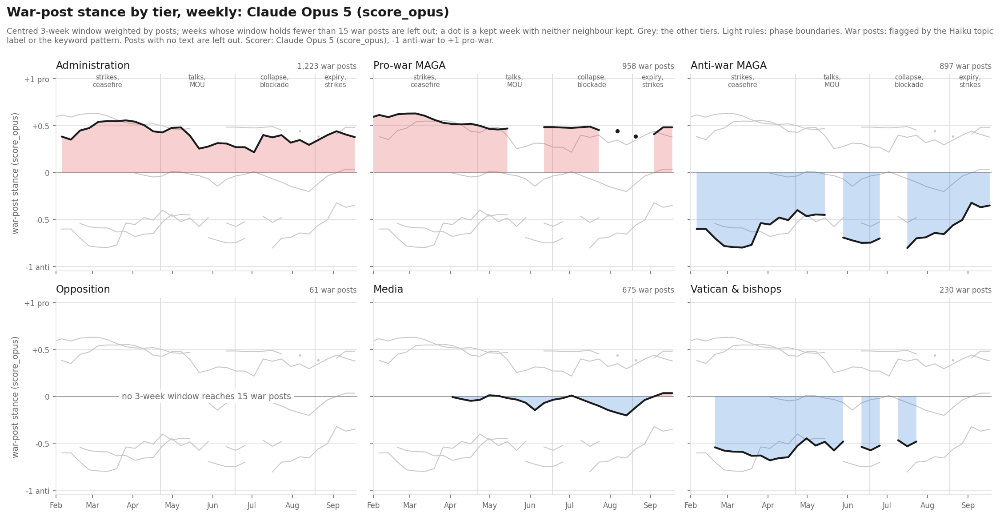
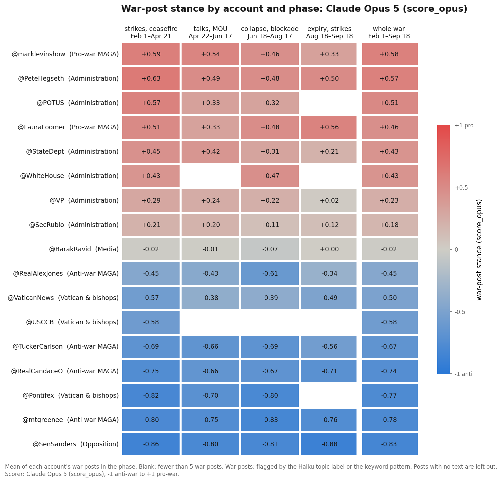

# iran-sentiment

Sentiment analysis of US political messaging during the 2026 Iran war
(Feb 1 -- Sep 18, 2026). Tracks the Trump administration, MAGA
influencers (both pro- and anti-war), the opposition, media, and the
Pope Leo XIV / Vatican moral axis across X and Truth Social, from a
month before the Feb 28 strikes through the Apr 8 ceasefire, the June
Islamabad deal and its July collapse, and the renewed strikes of
September.

X broadcaster data runs to 2026-09-18 (keyword searches are frozen at
May 12); Trump's Truth Social feed runs from Apr 4 to Sep 30, and the
replies to his eight tracked posts run to Sep 25. Nothing runs on a
schedule.

## Findings

19,605 posts from 17 X/Twitter accounts across 6 political tiers plus
4 keyword searches (a public-sentiment proxy, Feb-May only), plus 98,668 Truth Social
replies to 8 Trump posts (three from the April escalation, five from
the May-September deal-and-collapse cycle) and Trump's own Truth Social
feed from Apr 4 to Sep 30 (4,360 posts). Posts and replies with no text
to judge (fewer than 3 characters once links and a leading "RT @x: " are
removed: 490 X posts, nearly all bare links, 1,622 of Trump's posts,
6,357 replies) leave every count, share and mean below. Retweets and
ReTruths count as the account's own messaging (see *Data collection*).
Every X post with text carries four scores (5 still lack the Opus one):
VADER (lexicon baseline), RoBERTa
(`cardiffnlp/twitter-roberta-base-sentiment-latest`, valence), a Claude
Haiku 4.5 stance score, and a Claude Opus 5 stance score from -1.0
(anti-war) to +1.0 (pro-war), the last obtained by relabelling every
post through the Batch API after a teacher check showed Haiku misreading
the pro-war tier (see *Stance-model experiments*). **Stance numbers
below are the Opus score**; Haiku and RoBERTa are shown to make their
miscalibrations visible.

### Tier divergence



Weekly Opus stance of each tier's war posts, by the method of the table
below (posts with no text left out; a post is about the war when the
Haiku topic label or the keyword pattern says so), smoothed over a
centred three-week window weighted by posts. A week whose window holds
fewer than 15 war posts is left out, so a gap is thin data; a dot is a
kept week with neither neighbour kept. The opposition tier (one account,
61 war posts) draws no line. Each panel sets one tier against the others
in grey; light rules mark the four phases. Generated Oct 4 (`visualize`
writes it as `tier_war_weekly_score_opus.png`).

Pro-war MAGA stays between +0.38 and +0.63 and anti-war MAGA between
-0.80 and -0.32: the camps never meet. They are about 1.4 apart in early
March and closest in September, under 0.9 apart, when anti-war MAGA's
war posts, most of them @RealAlexJones's, eased to about -0.35.
Anti-war MAGA's late-March step towards zero is @RealAlexJones entering
the data on Apr 1 (the centred window shows it from the week of Mar 23),
not a change of stance. Pro-war MAGA's gaps are the collection hole of
late May and early June and the fortnightly sampling of its prolific
accounts, which also leaves its two August weeks as lone dots (see
*Limitations*).

| Tier | Opus, war posts | war share | Opus, all posts | Haiku, all | RoBERTa, all | n |
|------|-----------:|--:|-----------:|-------------:|--------:|--:|
| maga_prowar | **+0.54** [+0.52, +0.57] | 19% | **+0.253** | -0.057 | -0.206 | 5,107 |
| admin | +0.46 [+0.43, +0.49] | 26% | +0.219 | +0.183 | +0.149 | 4,617 |
| media | -0.03 [-0.05, -0.01] | 51% | -0.062 | -0.122 | -0.033 | 1,322 |
| religious_authority | -0.58 [-0.62, -0.54] | 10% | -0.137 | -0.180 | **+0.302** | 2,238 |
| search (public, Feb-May) | | | -0.143 | -0.326 | -0.346 | 1,768 |
| maga_antiwar | -0.55 [-0.58, -0.52] | 24% | -0.235 | -0.208 | -0.183 | 3,726 |
| opposition | -0.85 [-0.89, -0.79] | 18% | -0.202 | -0.391 | -0.315 | 332 |

**Read the war-post column.** The stance prompt asks for a stance on the
Iran war for every post, so Opus also scores "Deport them!", "Amen" and
"THANK YOU, PRESIDENT TRUMP!" (all pro-war, from who wrote them). Most
posts are not about the war, so an all-post average is mostly those
projected scores, and it moves whenever a camp posts more or less about
the war. The war-post column keeps only posts about the war (flagged by
keyword or by a Haiku topic label, see *Robustness checks*) with 95%
intervals from an account-day block bootstrap.

On the war itself, the two MAGA camps are **1.1 points apart** on a
two-point scale, not the 0.49 the all-post averages show. The pro-war
influencers are more hawkish than the administration (+0.54 vs +0.46,
intervals apart under every topic definition), and anti-war MAGA
(-0.55) sits alongside the Vatican, short of Sanders (-0.85).

### The pro-war tier was mislabelled, twice

Over all their posts, both cheap scorers put Mark Levin and Laura Loomer
on the anti-war side of zero. RoBERTa does it because their posts are
vicious in tone; Haiku does it for the same reason in weaker form,
scoring Levin's attacks on "Qatarlson" and "genocidal regimes" at -0.85
where Opus reads them as +0.60. On the whole dataset the two teachers
agree far better everywhere else than on this tier: 0.35 Pearson and 22%
opposite-sign labels on `maga_prowar`, against 0.63 to 0.89 and under 5%
flips on admin, anti-war MAGA and religious posts. Corrected, over all
posts @marklevinshow is +0.288 and @LauraLoomer +0.150; on their war
posts they are +0.56 and +0.45, where Haiku has +0.32 and +0.11. The
pro-war influencers are hawks, full stop.

### The religious sign flip

RoBERTa reads the Vatican tier as the *most positive* tier in the
dataset (+0.302 over all posts) because faith-based language ("peace",
"mercy", "dialogue") is lexically positive. Most of that comes from the
2,008 posts not about the war, where a warm tone is no error. On the
tier's 230 war posts RoBERTa sits at zero (-0.00) where Opus puts them
at -0.58, and 42% of them read positive to RoBERTa and anti-war to
Opus. @Pontifex is -0.310 over all posts and **-0.76 on his war posts,
level with @mtgreenee (-0.78) and behind only @SenSanders** (the strict
Haiku topic labels find only 3 war posts from him, and put
@RealCandaceO ahead of him too). Of 2,238 religious-tier posts, Opus
labelled none pro-war; Haiku gave seven a positive score (up to +0.70,
the USCCB post below). This tier is the reason the project moved to LLM
stance scoring in the first place.

### Who the hawks actually are

War posts only, Feb -- Sep: @PeteHegseth (+0.57) and @marklevinshow
(+0.56) are the most pro-war accounts, then @POTUS (+0.52), @LauraLoomer
(+0.45), @WhiteHouse (+0.44) and @StateDept (+0.43); @VP (+0.23) and
@SecRubio (+0.17) are the administration's mildest voices. At the other
end: @SenSanders (-0.85), @mtgreenee (-0.78), @Pontifex (-0.76) and
@RealCandaceO (-0.75). @RealAlexJones (-0.43) is the least anti-war of
the anti-war MAGA voices and @BarakRavid (-0.03) is neutral. @POTUS's
war posts are all retweets (106 of 106) and @PeteHegseth's nearly all
(400 of 419): reposting counts as messaging here (see *Data
collection*).

### Seven months: the administration went quiet more than it went soft

Opus stance of war posts by tier and phase, with the share of each
tier's posts that were about the war (keyword searches excluded; they
end May 12):

| Tier | Feb 1 -- Apr 21<br>strikes, ceasefire | Apr 22 -- Jun 17<br>talks, MOU | Jun 18 -- Aug 17<br>collapse, blockade | Aug 18 -- Sep 18<br>expiry, strikes |
|---|--:|--:|--:|--:|
| admin | +0.51 (37%) | +0.41 (31%) | +0.33 (13%) | +0.38 (7%) |
| maga_prowar | +0.57 (21%) | +0.46 (10%) | +0.47 (23%) | +0.41 (11%) |
| media | -0.03 (62%) | -0.02 (43%) | -0.08 (46%) | +0.00 (33%) |
| religious_authority | -0.62 (14%) | -0.53 (9%) | -0.54 (8%) | -0.55 (4%) |
| maga_antiwar | -0.57 (29%) | -0.49 (19%) | -0.68 (19%) | -0.42 (18%) |
| opposition | -0.86 (23%) | -0.80 (14%) | -0.83 (20%) | -0.91 (15%) |

(`python -m src.cli phases`; intervals in
`data/processed/phases_x_tier_score_opus_either.csv`.)

- **The administration's all-post average fell from +0.29 to +0.12,
  about half of it because it stopped posting about the war.** War posts
  went from 37% of its output to 7%. Splitting the -0.17 change: -0.09
  [-0.12, -0.07] is the smaller war share, -0.03 [-0.06, -0.00] is
  softer war posts, -0.05 is drift in its other posts. The share part is
  41% of the change under the keyword definition (about equal to the
  other-post drift, -0.07 and -0.08) and 65% under the strict labels.
  Its war posts did soften during the talks and the collapse (+0.51 to
  +0.33, significant under every topic definition). September's
  +0.38 is no measurable rebound: the collapse-to-September change is
  +0.05 [-0.08, +0.17], and no topic definition separates the two. 39 of
  those 46 September war posts are retweets. @StateDept shows both
  effects: war posts fell from 61% of its output in the strike phase to
  5% (five posts) in September, and those it did make eased from +0.45
  to +0.31 by the collapse.
- **The pro-war influencers pulled back less.** Their war share halved
  by September (21% to 11%; 12% to 3% under the strict labels), but the
  administration's fell further from a higher base. That is why their
  all-post average overtakes the administration's from July: volume, not
  a widening gap on the war itself. Their war posts did ease, from +0.57
  in the strike phase to +0.41 in September, a change of -0.16 [-0.27,
  -0.02] (keyword the same), close to the administration's -0.13 [-0.25,
  -0.01] over the same span. Under the strict labels they held at +0.58
  to +0.66 (-0.03 [-0.24, +0.19], on 8 September war posts), and the
  September cell rests on 15 account-days of its two sampled accounts.
- **Anti-war MAGA eased after the collapse; the rest of the anti-war
  side held.** Anti-war MAGA was hardest in the collapse phase (-0.68).
  By September it was at -0.42 (interval -0.59 to -0.28), a change of
  +0.27 [+0.08, +0.41] from the collapse (keyword +0.28; strict labels
  +0.21 [-0.00, +0.44]); against the strike phase (-0.57) the change,
  +0.15 [-0.04, +0.29], is not significant. Who was posting changed too:
  @RealAlexJones, the least anti-war of the four, wrote 41 of the tier's
  61 September war posts while @RealCandaceO's war share fell from 21% to
  5%. But Jones's own war posts also moved (-0.61 to -0.29), and how much
  of the change is composition is not established. The religious tier's
  war posts sat at about -0.55 from April on (-0.62 in the strike phase),
  but the strict labels find only 7, 1 and 0 religious war posts in the
  last three phases, so that holds under the keyword and default
  definitions only. It talked about the war less (14% of posts to 4%),
  which is most of its all-post "softening". @SenSanders never moved.
- **Media stayed near zero.** @BarakRavid's war posts are within 0.08 of
  zero in every phase under every topic definition; the all-post drift
  is in his other posts.

### Trump's own feed did not measurably soften

The X series above samples @POTUS at 789 posts, but @POTUS is the
official presidential account and all 789 are retweets, 783 of them of
@WhiteHouse. Trump's Truth Social feed is his own voice: 4,360 posts
from Apr 4 to Sep 30, 2,738 of them with text (the rest are images,
videos and ReTruths whose text the collector did not keep before Oct 4;
they leave the denominator), scored with the Opus-taught distilled model
(0.88 Pearson with Opus on held-out X posts; no feed post has an Opus
label). The phases run to Sep 18, where the X data ends.

| Phase | War posts | share of posts | all posts |
|---|--:|--:|--:|
| Apr 4 -- Apr 21 | +0.42 [+0.27, +0.55] | 33% | +0.180 |
| Apr 22 -- Jun 17 | +0.36 [+0.27, +0.44] | 14% | +0.099 |
| Jun 18 -- Aug 17 | +0.30 [+0.23, +0.37] | 12% | +0.080 |
| Aug 18 -- Sep 18 | +0.38 [+0.33, +0.45] | 13% | +0.084 |

The intervals overlap in every phase and under every topic definition
(the strict Haiku labels put all four between +0.42 and +0.52), and the
direct September-minus-April contrast is -0.04 [-0.19, +0.13] (+0.02
[-0.12, +0.19] under the strict labels): no measurable change, though a
drop of up to about 0.2 can't be ruled out. What changed is how much he
talks about it, a third of his posts in April and 12-14% since, the same
pattern as the administration's accounts on X.

### Per-account detail



The heatmap is the war-post view by account: the mean Opus stance of
each account's war posts in each phase and over the whole war, the
numbers `phases --by user` writes, with posts with no text left out and
a cell left blank under 5 war posts. Accounts run from most pro-war to
most anti-war over the whole war; red is pro-war and blue anti-war, the
blog post's colours. Generated Oct 4 (`visualize` writes it as
`account_war_phases_score_opus.png`).

- No account other than @BarakRavid, who stays at zero (-0.08 to
  +0.00), changes side in any phase.
- The anti-war end barely moves: @SenSanders, @mtgreenee,
  @RealCandaceO and @Pontifex stay between -0.68 and -0.91 in every
  phase they have. @RealAlexJones is the one that moves (-0.61 in the
  collapse, -0.29 from Aug 18) and is the least anti-war of the
  anti-war MAGA accounts in every phase. @TuckerCarlson posts rarely
  (221 posts with text, 62 about the war, in seven months) but is
  anti-war in every phase (-0.51 to -0.74).
- On the pro-war side most of the administration's accounts soften
  after the strike phase: @POTUS +0.57 to +0.33 and +0.32, @StateDept +0.45 to
  +0.19 by Aug-Sep, @PeteHegseth +0.63 to about +0.5. @marklevinshow
  eases to +0.33 from Aug 18 (16 war posts) while @LauraLoomer is at
  +0.51.
- Over all posts (not shown), @mtgreenee (-0.320) and @Pontifex (-0.310)
  are the most anti-war accounts, with @RealCandaceO (-0.246) and
  @TuckerCarlson (-0.244) next; on war posts @SenSanders leads.
- Over all posts @SenSanders lands at -0.202 under Opus against -0.391
  under Haiku: much of his output is procedural (war powers votes,
  hearings) and Opus reads it as neutral where Haiku read it as
  opposition.
- Blank cells are under 5 war posts: @USCCB after the strike phase (5
  war posts across the three later phases), @WhiteHouse in the talks
  phase (none), and @POTUS, @WhiteHouse, @SecRubio and @Pontifex from
  Aug 18 (2 to 4). The talks and collapse cells of @marklevinshow,
  @LauraLoomer, @RealAlexJones and @WhiteHouse rest on part of each
  phase, a collection limit, not silence (see *Limitations*), and the
  strike-phase cells of the nine accounts whose data starts between
  Feb 21 and Apr 9 miss their earliest posts (see *Data collection*).

### Audience replies: eight Trump posts, April to September

Every direct reply to eight Trump Truth Social posts (98,668 replies,
95-99% of each post's reply count; 98,663 once 5 collected twice are
dropped, and the 92,306 of those with text are used below) scored with
RoBERTa, plus a stratified sample of 1,292 replies (50 per sentiment
bucket per post) classified by Claude Haiku into stance categories.
`event-study` still prints the table below over every reply, textless
ones included, so its figures differ.

| Post | Date | Replies | RoBERTa mean | Critical | Supportive |
|---|---|--:|--:|--:|--:|
| "Power Plant Day" rant | Apr 5 | 22,109 | -0.255 | 57% | 25% |
| "Whole civilisation will die" | Apr 7 | 15,282 | -0.387 | 64% | 18% |
| Two-week ceasefire | Apr 7 | 15,978 | -0.328 | 61% | 20% |
| "Hold off on our planned Military attack" | May 18 | 8,420 | **-0.498** | **72%** | 11% |
| "The Deal with Iran is now complete" | Jun 14 | 11,979 | **+0.200** | 34% | **52%** |
| "These fools, who think I haven't been tough enough" | Jun 18 | 3,913 | -0.428 | 68% | 15% |
| "Striking Iranian Targets near Hormuz" | Sep 1 | 4,193 | -0.273 | 58% | 23% |
| "Change the name Hormuz Strait to TRUMP STRAIT" | Sep 2 | 10,432 | -0.057 | 40% | 32% |

- **Restraint was punished harder than escalation.** The May 18 post
  announcing a called-off attack is the most negative post in the
  dataset, and the only one where loyalty makes no clear difference
  (high-loyalty tier -0.54 vs low-loyalty -0.49; the gap, -0.05
  [-0.10, +0.00], includes zero, where on every other post the
  loyalists are clearly the least negative). The Haiku sample shows why:
  it has the highest share of `pro_war_critical` replies of any post
  (12.7%), people angry that Trump did not strike.
- **The deal was the only thing the audience liked.** June 14 is the
  sole net-positive post, with a steep loyalty gradient (+0.05 low to
  +0.43 high). Even so, a third of the sampled replies are anti-war
  in some form (betrayal 10.7%, opposition 15.3%, pro-Trump-anti-war
  10.0%).
- **Renewed strikes re-consolidated the base.** The September 1 strikes
  post has the highest `pro_war_supportive` share in the sample (56%)
  and, apart from the TRUMP STRAIT joke, the lowest betrayal share
  (4.7%), while its population-level RoBERTa mean (-0.27) is close to
  the April "Power Plant Day" post's (-0.26).
- **The within-MAGA "betrayal" voice persists at 5-12% on every post
  but one** ("voted 3x for you, losing me as a supporter"), peaking on
  the April rant and the June deal, not on the strikes. The TRUMP
  STRAIT post, a proposal to rename the strait, draws almost none
  (1.3%).
- **The two posts added in September sit mid-range.** "These fools"
  (Jun 18), aimed at critics who say he hasn't been tough enough on
  Iran, is the second most negative by valence (-0.428), with 35%
  `pro_war_supportive` and 9% betrayal in the sample, and the largest
  share of replies with no text (12%). "TRUMP STRAIT" (Sep 2)
  is close to neutral in tone (-0.057) and has the largest
  `pro_trump_antiwar` share of any post (12%).

**Population-level stance.** The distilled stance model (see
*Stance-model experiments* below) scored every reply at its 256-token
training length. It was trained on broadcaster posts, and on replies it
leans pro-war: against the 1,157 replies with text that Opus labelled
directly it agrees at 0.70 Pearson with 15% opposite-sign labels, and
calls 63% pro-war where Opus calls 55%. So the table below corrects it:
the 1,071 of those labelled replies that were random draws (50 per
sentiment bucket per post, kept fixed in
`data/processed/reply_sample_draws.parquet`) are weighted back to each
post's count of replies with text, and the model's census figure is
shifted by the weighted gap between Opus and the model on them
(`python -m src.cli reply-population`; 95% intervals from resampling
within buckets). The estimand is the replies with text: the 6,357
replies with none (an image or GIF, or one or two characters) are left
out, not imputed.

| Post | Replies | RoBERTa valence | Model stance | **Opus-corrected stance** | Anti-war | Pro-war |
|---|--:|--:|--:|--:|--:|--:|
| "Power Plant Day" rant | 22,109 | -0.255 | +0.036 | +0.02 [-0.05, +0.09] | 37% | 43% |
| "Whole civilisation will die" | 15,282 | -0.387 | -0.011 | **-0.13** [-0.22, -0.05] | **53%** | 37% |
| Two-week ceasefire | 15,978 | -0.328 | +0.195 | +0.07 [-0.02, +0.15] | 36% | 47% |
| "Hold off on our planned Military attack" | 8,420 | **-0.498** | +0.237 | +0.07 [-0.02, +0.16] | 39% | 53% |
| "The Deal with Iran is now complete" | 11,979 | +0.200 | +0.222 | +0.23 [+0.16, +0.29] | 22% | 63% |
| "These fools, who think I haven't been tough enough" | 3,913 | -0.428 | +0.079 | +0.05 [-0.06, +0.16] | 34% | 45% |
| "Striking Iranian Targets near Hormuz" | 4,193 | -0.273 | +0.322 | **+0.28** [+0.19, +0.35] | 31% | 58% |
| "Change the name Hormuz Strait to TRUMP STRAIT" | 10,432 | -0.057 | +0.058 | +0.07 [-0.00, +0.13] | 35% | 44% |
| All eight | 92,306 | | +0.116 | +0.05 [+0.02, +0.08] | 37% | 47% |

- **The audience leans pro-war, but not by the margin the model said.**
  Across all eight posts it is 47% pro-war to 37% anti. Seven of eight
  posts have more pro-war than anti-war replies; the September strikes
  post has the most hawkish audience by mean (+0.28), the June deal the
  largest pro-war share (63%).
- **"Civilisation will die" is the one net anti-war audience**: 53% anti
  to 37% pro, interval clear of zero. The NYT's "majority critical"
  reading of that post was about tone; on stance the anti-war share is
  also about half (interval 46% to 62%).
- **Stance and tone diverge most on May 18.** The angriest post by
  valence (-0.50) has a pro-war-leaning audience (53% pro to 39% anti;
  mean +0.07, interval crossing zero): the base was furious *that Trump
  held off*. This is one of the posts where the missing parent context
  (below) can push assent toward pro-war, so the lean may be smaller.
- **Loyalty predicts hawkishness on every post** (distilled-model
  scores; loyalty tiers low / mid / high: 0.00 / +0.06 / +0.19 on the
  April rant, up to +0.25 / +0.36 / +0.48 on the September strikes). The
  correction above is per post, not per loyalty tier, so these levels
  carry the model's pro-war lean; the ordering is what to rely on.

**Known limits of the Opus reply labels**, pending a relabel: 423 of the
1,225 labels were made from reply text cut to 100 characters, and Opus
labelled each reply without seeing the Trump post it answers. By a rough
keyword count, replies that only express agreement under the ceasefire,
hold-off and deal posts (105 of them) are labelled pro-war about three
times in four, so those posts' pro-war shares (the deal's 63% above all)
may be too high. Both limits feed the correction above, and neither is
in its intervals.

The Haiku category shares in the first set of bullets come from a
bucket-balanced sample, so they describe the spectrum of each post's
replies, not population proportions. In the population table every
column is a population figure: RoBERTa valence, model stance, and the
Opus-corrected stance with its anti-war and pro-war shares. RoBERTa's
blind spots are the same as on the broadcaster data: `pro_war_critical`
replies read as negative (-0.55) and `pro_trump_antiwar` replies read
as positive (+0.13).

## Methodology

### Data collection

- X/Twitter: v2 API, per-account JSONL caching, incremental refresh
  (each run appends only tweets newer than the latest cached one),
  capped at 500 tweets per account per run to control cost
  ($0.005/read). Long gaps are walked in two-week slices with the cap
  shared evenly across slices, so a cap hit costs part of a fortnight
  rather than whole months. But a capped slice keeps only its newest
  posts: for the heaviest accounts that is the last day or two of each
  fortnight (a median of 0.7 days for @RealAlexJones, 1.6 for
  @marklevinshow). The five most prolific accounts were sampled at 450
  for the May-September refresh, and eight others hit the cap in some
  slices too.
- Retweets count as the account's own messaging (so do Trump's
  ReTruths). They are 32% of the X account posts (5,683 of 17,837) and
  70% of the administration's; @POTUS, the official presidential
  account, posted nothing but retweets (789, 783 of them of
  @WhiteHouse). The timeline returns a retweet's text cut to about 140
  characters, and the collector does not fetch the original, so
  retweets are scored on that prefix.
- Until Oct 4 the collector did not request X's `note_tweet` field, so
  about 2,000 cached posts over 280 characters are stored, topic-flagged
  and Opus-labelled from their first 280 characters: about 14% of war
  posts, 32% of the religious tier's and 25% of pro-war MAGA's. New
  collections get the full text; the cached posts need a paid re-read.
- Posts and replies with no text (fewer than 3 characters once links
  and a leading "RT @x: " are removed, `src/text_rules.py`) are not
  scored and leave every share and mean: 490 X posts (nearly all bare
  links), 1,622 of
  Trump's 4,360 Truth Social posts (images, videos, and ReTruths whose
  text the collector dropped before Oct 4) and 6,357 replies.
- Keyword searches use `/search/recent`, which only reaches back 7
  days. Searches were refreshed on Apr 16 and May 12 and not since, so
  the search tier covers Feb 1 to May 12 with a gap from roughly Apr 20
  to May 5, and is excluded from the phase comparisons above.
- Truth Social: `curl_cffi` (Cloudflare bypass). Account feeds via the
  public API with an incremental, resume-safe refresh; replies via the
  authenticated v2 descendants endpoint after a one-time `ts-login`
  (Truth Social's new-device security-code check).
- Window: Feb 1 -- Sep 18, 2026 for accounts, with pre-war context
  events back to Jun 2025. Nine accounts start late in the cached data:
  @VaticanNews on Feb 21, then @POTUS Feb 27, @Pontifex Mar 3,
  @StateDept Mar 4, @VP Mar 17, @BarakRavid Mar 30, @RealAlexJones
  Apr 1, @LauraLoomer Apr 6 and @WhiteHouse Apr 9 (cause unverified).
  The strike-phase cells miss their earlier posts: all of media's
  strike-phase war posts are from Mar 30 on, and the late-March step up
  in the anti-war MAGA series (the blog's weekly chart) is
  @RealAlexJones entering the data, not a change of stance.

### Sentiment scoring

Four scorers, in order of cost:

1. VADER -- rule-based lexicon baseline. Can't distinguish "we
   destroyed their nuclear facility" (triumphant) from "destroyed"
   (negative lexical). Included to show why lexicon-based sentiment
   fails on war rhetoric.
2. RoBERTa -- `cardiffnlp/twitter-roberta-base-sentiment-latest`,
   fine-tuned on Twitter text. A valence signal, not a stance signal:
   it has a systematic positive bias on institutional language and
   sign-flips the religious tier. Batched CPU inference with memory
   checkpointing (the pipeline runs on a fanless mini PC).
3. Claude Haiku stance -- JSON-scored stance from -1.0 (anti-war) to
   +1.0 (pro-war), with an `off_topic` pre-filter. Run over the full
   dataset (100% coverage). Good on most tiers but reads angry hawkish
   posts as anti-war (see *Stance-model experiments*).
4. Claude Opus 5 stance -- the same prompt, verbatim, at low effort,
   over every labelled post through the Message Batches API (half
   price). The stance of record for every number in this README.

The shared prompt (`llm_prompt` in `src/analysis/sentiment.py`, also
used for the Opus reply labels and the local models) asks for the
*sentiment* of a post about the Iran war, names its author, and sets
the scale from "very negative/anti-war" to "very positive/pro-war". It
ties negative to anti-war in its own words, which leaves room for the
tone reading that trips Haiku on the pro-war tier.

### Robustness checks

All free, all reproducible from the cached data (`src/analysis/inference.py`):

- **What counts as a war post.** The stance prompt makes Opus score
  every post, and it gives off-topic posts a stance from the author
  (Hegseth's "It's time." +0.40, Levin's "Amen" +0.60). Three
  definitions of "about the war": a keyword pattern
  (`WAR_TOPIC_PATTERN`, loose: misses unnamed strikes, catches "culture
  war"), a Haiku 4.5 yes/no label on every post (`topic-label`, Batch
  API, about $3 for 22,197 posts; strict: drops the Pope's war appeals
  that never name Iran; posts with text it has no label for, 136 on X
  and 183 in Trump's feed, fall back to the keyword), and either of the
  two (the default, 23% of X posts). Keyword and either barely differ
  (at most 0.02 in any X tier-phase cell); the strict labels are the
  real test. Under all three the headline gaps keep their signs and
  order: the MAGA war-post gap (1.09 to 1.18 over the whole war),
  pro-war MAGA above the administration with whole-war intervals apart,
  the administration's softening into the collapse, anti-war MAGA
  hardest in the collapse phase, and Trump's phase intervals
  overlapping. Levels hold less well: 7 of the 24 X tier-phase cells
  move by more than 0.1 between the strict and default definitions, up
  to 0.22 (pro-war MAGA in September, on 8 strict war posts; the
  administration's September cell moves 0.17 on 22), Trump's phases by
  up to 0.14 and single accounts by up to 0.19. Some strict cells are
  too sparse to read: the religious tier has 7, 1 and 0 strict war posts
  in the last three phases, and @Pontifex 3 in all.
- **Uncertainty.** 95% intervals resample account-days within each
  account (1,000 replicates), so same-day posts move together. Each
  account keeps its total number of days, but they are drawn from its
  whole series, so its days in any one phase, and its weight within a
  tier, vary between replicates. They are sampling noise for these 17
  accounts, not a claim about accounts we did not track. Overlapping
  intervals are not a test of no change: the phase-to-phase changes
  quoted above are direct contrasts on the same replicates.
- **Shift-share decomposition.** A tier's all-post change between two
  phases splits exactly into (change in war share) x (war-post mean minus
  other-post mean), (average war share) x (change in war-post stance),
  and the same for other posts, each with its own interval.
- **Opus test-retest.** 497 posts were labelled twice by Opus 5, once
  through the direct API (the teacher check) and once in the batch
  relabel: 82% identical scores, 95% within 0.1, Pearson 0.991, no
  opposite-sign pairs (`teacher-retest`). The 82% is flattered by the
  270 pairs where both labels are exactly 0; among the rest, 61% are
  identical. Label noise is small next to every effect reported.
- **Reply population shares** are corrected against Opus labels on a
  random, bucket-stratified sample of replies with text (see *Audience
  replies*).

### Event overlay

84 events are catalogued in `config/timeline.py` (military strikes,
diplomatic moments, polling, media events) and overlaid on time-series
plots. The first 36 cover the pre-war build-up through Apr 15; 48 more,
added Sep 2026 from a web-research pass with independent fact-checking,
cover May 12 -- Sep 15 (the Islamabad MOU of Jun 17, its collapse Jul 8,
expiry Aug 17, and the renewed strikes of September). Each event carries
an importance score; `EVENT_LABEL_MIN_IMPORTANCE` in settings controls
which get labelled on plots. Source URLs for the new events are in
`docs/timeline_candidates_2026-05-12_to_2026-09-15.json`. Both data
layers now run past Sep 15, so every event is plotted.

## Stance-model experiments (GPU, Sep 2026)

Can the per-post Haiku call be replaced by something that runs free on
the homelab's RTX 3080? Three one-shot Kubernetes Jobs (`k8s/README.md`),
all evaluated on the same per-tier held-out split against the Haiku
labels the dataset carries:

| Candidate | Pearson | MAE | Sign agreement | Sign flips |
|---|--:|--:|--:|--:|
| RoBERTa valence (`score_transformer`, the current quick-look scorer) | 0.28 | 0.45 | 38% | 14.9% |
| Qwen2.5-7B-Instruct, 4-bit, same prompt as Haiku (920 posts) | 0.47 | 0.38 | 49% | 9.7% |
| Qwen3-8B, 4-bit, thinking off, same prompt (920 posts) | 0.48 | 0.38 | 63% | 8.8% |
| Qwen3-8B, 4-bit, thinking on, 1,024-token budget (363 of 399 posts parsed) | 0.59 | 0.32 | 68% | 5.2% |
| RoBERTa-large fine-tuned on the Haiku labels (3,893 posts) | 0.75 | 0.15 | 78% | 4.9% |
| DeBERTa-v3-large fine-tuned on the Haiku labels (3,893 posts) | 0.79 | 0.14 | 78% | 4.1% |
| **DeBERTa-v3-large fine-tuned on the Opus labels** (3,881 posts, vs Opus) | **0.88** | **0.11** | 78% | **2.1%** |
| Full recipe sweep on the Opus labels: six RoBERTa variants 0.81 to 0.87, DeBERTa at 256 tokens **0.869** (SD 0.011 over 5 folds) | | | | |

The distilled encoder is the clear winner: 7.5 minutes of training, then
all 98,668 replies in about 20 minutes. A recipe sweep put six RoBERTa variants between 0.71 and 0.75
Pearson, and DeBERTa-v3-large (fit with 8-bit AdamW and gradient
checkpointing to fit the 10 GB card) at 0.79. The winner cross-validates
at **0.79 Pearson (SD 0.003 over 5 folds)** with 78% sign agreement and
4.5% flips. Architecture bought four points; the rest of the gap to a
perfect reproduction is the labels' own noise (Haiku agrees with Opus 5 at
only 0.64), which is what the Opus relabel below addresses. It is strongest exactly where the valence
model failed, 0.90 Pearson and 0.4% flips on the religious tier. The
open 7B/8B models with the Claude prompt are only modestly better than
valence and not a Haiku substitute; the 2025 generation (Qwen3) fixes
many sign errors (63% agreement vs 49%) but its correlation with the
teacher is unchanged, and it is weakest on the admin tier (0.18).
Letting it reason first lifts it to 0.59 with 5% flips, at a price:
9% of answers never reached JSON inside the token budget and 399 posts
took 2.6 hours, so it is neither accurate enough to replace the
distilled model nor fast enough to score 83,000 replies.

**The relabel.** Every labelled post was re-scored by Claude Opus 5
through the Batch API (19,452 of 19,457 parsed after one resubmit, about $31). Retrained on
those labels, the same DeBERTa recipe reproduces its teacher at 0.88
Pearson with 2.1% flips, against 0.79 and 4.1% on Haiku's: the Opus
labels are simply more self-consistent, so the "ceiling is the labels"
diagnosis was right. Per tier the Opus-taught model reaches 0.90 on
admin, 0.91 on religious and 0.82 on the pro-war tier where the
Haiku-taught one had its second-weakest result. On the same held-out
rows, RoBERTa valence agrees with Opus stance at 0.06 Pearson, which is
to say not at all. Rerunning the whole recipe sweep on the Opus labels moved every recipe
up by about a tenth and kept DeBERTa-v3-large on top, though not the
order within it or among the RoBERTa variants. The 256-token recipe
scored 0.8757 against 0.8712 at 128 tokens, a margin of 0.0045, smaller
than the 0.0051 between two runs of the identical 128-token recipe
(0.8712 and 0.8763), so the two are a tie; the 256-token fit cross-validates at
0.869 (SD 0.011 over 5 folds) with 2.4% flips. Its full-label fit is
`data/models/stance_distilled_final_score_opus/`, the reply scorer of
record (`score_opus_distilled`), run at its 256-token training length.

**Mixing replies into the training set did not help.** The same recipe
retrained with the 958 Opus-labelled replies added (767 in training,
191 held out: 20% within each post, so every post is on both sides)
reproduces Opus at 0.874 Pearson with 2.2% flips on the 3,881 held-out
posts, against 0.876 and 2.1% for the posts-only model on the same posts
(0.861 on the combined holdout with the replies). On the held-out replies it
lands at 0.71 Pearson and 64% sign agreement with about 10% flips per
post, which is about what the posts-only model scores on the same kind
of rows (0.72 / 66% on all of them). Reply stance is harder than
post stance for both students -- short, sarcastic, addressed to Trump
rather than about the war -- and a few hundred extra labels do not move
it. Scored over all 98,668 replies the two models agree at 0.89 Pearson
and 73% on sign, and no post mean moves by more than 0.06, so every
population-level number above stands. On the two posts added in
September, whose replies neither model had seen, the mixed model does a
little better (0.66 vs 0.60 Pearson, 11% vs 14% flips on 267
Opus-labelled replies), but the 95% interval on the gap runs from -0.01
to +0.12: a lean, not a reason to switch. `score_mixed_distilled` is
kept as a column for comparison; `score_opus_distilled` remains the
scorer of record.

**The reply scores came from an overwritten fit (fixed 2026-09-30).**
`distill --fit-all` and the sweep's final fit both wrote to
`stance_distilled_final_score_opus/`. The replies were scored with the
128-token `distill-opus` fit hours before the sweep's 256-token fit
replaced it in place, so the reply column no longer matched the model
on disk: 0.915 correlation on replies too short to truncate, where any
rerun of the current model reproduces exactly. All 98,668 replies and
Trump's feed are now scored by the current model at its training
length; the old scores are kept as `score_opus_distilled_v0`. The two
fits are about as good against Opus on the 958 older labelled replies
(0.72 vs 0.71 Pearson), and the corrected reply shares moved by up to 5
points, inside their intervals. Scoring at 128 rather than 256 tokens
on its own changes nothing that matters (Trump's phase means by 0.01 at
most). A final model dir is now never overwritten, and scoring reads the
training length from the model's `recipe.txt`.

**Why the teacher had to change.** A check of 497 posts, 71 per tier,
relabelled by Claude Opus 5 shows Haiku and Opus agreeing on most tiers
(0.76 to 0.78 Pearson and 82 to 90% sign agreement on admin, anti-war
MAGA and religious) but not on the pro-war tier: 0.34 Pearson and 24%
sign flips. Haiku scores Mark Levin's vicious attacks on the anti-war
right as anti-war (-0.85) because of their tone; Opus reads them as
hawkish (+0.60). Haiku also marks praise of peace as pro-war (a USCCB
post commending the agreement at +0.70). This is RoBERTa's failure mode
in weaker form, so Haiku's `maga_prowar` averages were too low, and a
model distilled from Haiku inherits the bias. That is why the dataset
was relabelled with Opus 5 and the scorer distilled from that (*The
relabel*, above).

Artifacts: `data/models/stance_distilled*/` (models, holdout predictions,
metrics), `data/models/sweep*/`, `data/processed/truthsocial_trump_stance.parquet`, `data/processed/teacher_check_claude-opus-5.*`,
`data/processed/local_llm_Qwen_*.*`.

## Setup

Requires Python 3.11+.

```bash
python -m venv .venv
source .venv/bin/activate
pip install torch --index-url https://download.pytorch.org/whl/cpu   # CPU build; skip on a CUDA box
pip install -e '.[dev,truthsocial]'   # truthsocial brings curl_cffi; dev brings pytest + ruff
```

Credentials live in `secrets.env`, committed encrypted with sops + age
(homelab-infra `docs/secrets.md`; the private key is on dkbl1). Decrypt it
into the working `.env` the code reads:

```bash
sops -d secrets.env > .env          # on dkbl1, SOPS_AGE_KEY_FILE=~/.config/homelab-infra/age.key
sops secrets.env                    # edit a value in place; then re-run the line above
sops -e .env > secrets.env          # or edit .env and re-encrypt; commit secrets.env
```

Without the key, copy `.env.example` to `.env` and fill in credentials:

```bash
cp .env.example .env
# Edit .env with your X API bearer token and (optionally)
# Truth Social credentials and Anthropic API key
```

## Usage

Everything runs through a single CLI:

```bash
python -m src.cli test          # verify X API credentials
python -m src.cli status        # show what's cached vs. missing
python -m src.cli collect       # incremental X fetch (appends new tweets only)
python -m src.cli collect-truth # incremental Truth Social feed refresh
python -m src.cli ts-login      # one-time login (security code) -> token in .env
python -m src.cli collect-replies  # fetch replies to tracked Trump posts (needs token)
python -m src.cli analyze       # score all cached data (VADER + RoBERTa)
python -m src.cli analyze --llm # add Claude stance scores (restart-safe)
python -m src.cli visualize     # regenerate all figures
python -m src.cli summary       # stance tables (Opus stance of record by default)
python -m src.cli event-study   # reply sentiment + event-window analysis
python -m src.cli run-all       # collect + analyze + visualize + summary (paid X reads; no relabel)
```

`collect` is incremental at the per-account level: each rerun fetches
only tweets newer than the latest cached `created_at` and appends.
Pass `--force` to re-fetch an account's whole window. To add accounts
or search terms, edit `config/accounts.py` and rerun. `analyze --llm`
skips posts that already have a stance score, so re-running after a
collect only spends tokens on new posts.

## Project structure

```
config/
  settings.py          # paths, budget caps, batch sizes, tier colors
  accounts.py          # X/Truth Social handles organized by tier
  timeline.py          # 84 key events (Jun 2025 - Sep 2026) for plot overlays
  tracked_posts.py     # specific Trump posts for reply analysis
src/
  cli.py               # Click CLI -- single entrypoint
  collectors/
    x_collector.py     # X API v2, per-account JSONL cache, incremental fetch
    truthsocial_collector.py  # Truth Social API + curl_cffi
  analysis/
    sentiment.py       # VADER + RoBERTa + Claude stance scoring
    event_study.py     # reply sentiment + event-window comparisons
  visualization/
    plots.py           # timeline, tier comparison, heatmap, search plots
data/                     # gitignored -- not included in repo
  raw/x/*.jsonl           # per-account tweet caches
  raw/truthsocial/*.jsonl # Truth Social posts + replies
  processed/*.parquet     # scored sentiment data
  processed/figures/*.png # generated plots
docs/figures/             # LLM-stance figures (two are embedded above)
```

## Limitations

- 17 X accounts across 6 tiers is illustrative, not representative.
  The opposition tier is a single account (332 posts with text).
- VADER and RoBERTa are valence proxies. Any stance comparison across
  tiers must use `score_opus`; the RoBERTa number for the religious
  tier is actively misleading.
- X's user-timeline endpoint only returns an account's most recent
  ~3,200 tweets. The September refresh came four months after the
  last one, so for the most prolific accounts the early part of that
  gap is unrecoverable: no posts before Jun 20 for @marklevinshow,
  Jul 4 for @LauraLoomer, Jul 17 for @WhiteHouse and Jul 31 for
  @RealAlexJones. Their phase-two numbers rest on April and early May
  only. The other 13 accounts have no such hole.
- Nine accounts start after Feb 1, the last on Apr 9, so the strike
  phase is missing their earlier posts (see *Data collection*).
- The five most prolific accounts are sampled (450 per refresh spread
  across two-week slices), not exhaustive, from May 10 on. A capped
  slice keeps its newest posts, so these accounts are represented by
  the last one to three days of each fortnight, and eight other accounts hit
  the cap in some slices too.
- Retweets are stored cut at about 140 characters (the collector does
  not fetch the original), and about 2,000 long X posts collected before
  Oct 4 are cut at 280 until a paid re-read (see *Data collection*).
  Their topic flags and Opus labels come from the cut text.
- Search coverage stops at May 12 and has a gap in late April (see
  *Data collection*).
- Truth Social's API may truncate large reply trees. Coverage is
  validated per-post during collection.
- "About the war" has no crisp boundary (a papal appeal for peace that
  names no country; an attack on Tucker Carlson). The headline gaps
  keep their signs and order under all three definitions; the levels do
  not all hold. Several tier-phase cells move by more than 0.1 (up to
  0.22), and strict-label cells such as the religious tier's late
  phases are too sparse to read (see *Robustness checks*).
- Trump's feed is scored by a model validated on X posts only; no feed
  post has an Opus label.
- Nothing is checked against human coders. Opus is the reference for
  every stance number, and its prompt asks for sentiment on a negative /
  anti-war to positive / pro-war scale (see *Sentiment scoring*).
- The Opus reply labels behind the corrected shares were made from text
  cut to 100 characters for 423 of 1,225 replies, and without the Trump
  post each reply answers. Both are open until a paid relabel (see
  *Audience replies*).
- The loyalty-tier reply numbers carry the distilled model's pro-war
  lean; only the per-post shares are corrected. Repliers are not voters
  or followers: the 98,668 replies come from 62,661 accounts, and the
  loyalty tiers rest on current bios and account age.
- This is observational sentiment tracking, not causal inference. Event
  overlays show correlation, not causation.

## Cost

X API reads cost $0.005/tweet. Collection through Apr 20 (9,477
tweets) cost about $47; the May 10/12 refresh added roughly 4,500
tweets, about $22; the Sep 18 refresh read 5,631 tweets, about $28. LLM stance scoring of the full dataset ran
about $15 on Claude Haiku through April; the May 12 pass over the
~4,500 new posts was about $2 (672k input + 267k output tokens on
Haiku 4.5, from the console usage page). September 2026 on the Anthropic
side: about $3 for the Haiku refresh, $31 for the Opus 5 relabel of
19,500 posts (Batch API) and $2 for 958 Opus reply labels (direct
API), about $1 for the teacher checks, and about $3 for the Haiku topic labels on 22,197
posts. The Sep 30 refresh added about $0.90 (Haiku stance on 300 sampled
replies and Opus labels on 267, direct API; Haiku topic labels on 838
posts, Batch API). Truth Social API
access is free.
