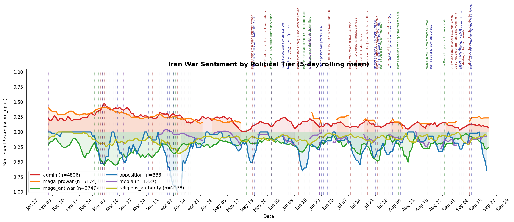
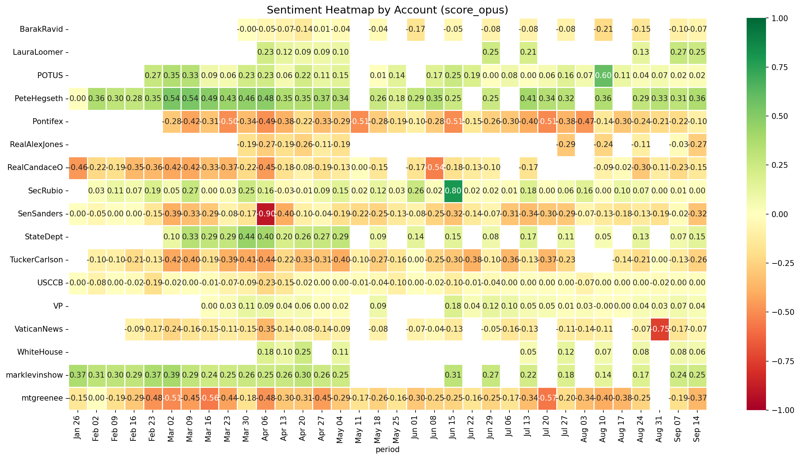

# iran-sentiment

Sentiment analysis of US political messaging during the 2026 Iran war
(Feb 1 -- Sep 18, 2026). Tracks the Trump administration, MAGA
influencers (both pro- and anti-war), the opposition, media, and the
Pope Leo XIV / Vatican moral axis across X and Truth Social, from a
month before the Feb 28 strikes through the Apr 8 ceasefire, the June
Islamabad deal and its July collapse, and the renewed strikes of
September.

X broadcaster data runs to 2026-09-18 (keyword searches are frozen at
May 12); the Truth Social layer -- Trump's feed and the reply-level
audience analysis -- runs through 2026-09-16. Nothing runs on a
schedule.

## Findings

19,605 posts from 17 X/Twitter accounts across 6 political tiers plus
4 keyword searches (a public-sentiment proxy, Feb-May only), plus 83,054 Truth Social
replies to 6 Trump posts (three from the April escalation, three from
the May-September deal-and-collapse cycle) and Trump's own Truth Social
feed from Apr 4 to Sep 16 (4,087 posts). Every post carries four scores: VADER (lexicon baseline), RoBERTa
(`cardiffnlp/twitter-roberta-base-sentiment-latest`, valence), a Claude
Haiku 4.5 stance score, and a Claude Opus 5 stance score from -1.0
(anti-war) to +1.0 (pro-war), the last obtained by relabelling every
post through the Batch API after a teacher check showed Haiku misreading
the pro-war tier (see *Stance-model experiments*). **Stance numbers
below are the Opus score**; Haiku and RoBERTa are shown to make their
miscalibrations visible.

### Tier divergence



| Tier | Opus, war posts | war share | Opus, all posts | Haiku, all | RoBERTa, all | n |
|------|-----------:|--:|-----------:|-------------:|--------:|--:|
| maga_prowar | **+0.54** [+0.52, +0.57] | 18% | **+0.247** | -0.056 | -0.199 | 5,174 |
| admin | +0.46 [+0.43, +0.49] | 25% | +0.211 | +0.175 | +0.143 | 4,806 |
| media | -0.03 [-0.05, -0.01] | 50% | -0.062 | -0.120 | -0.032 | 1,337 |
| religious_authority | -0.58 [-0.62, -0.54] | 10% | -0.137 | -0.180 | **+0.302** | 2,238 |
| search (public, Feb-May) | | | -0.143 | -0.325 | -0.346 | 1,765 |
| maga_antiwar | -0.55 [-0.58, -0.52] | 24% | -0.234 | -0.206 | -0.180 | 3,747 |
| opposition | -0.85 [-0.89, -0.79] | 18% | -0.199 | -0.384 | -0.303 | 338 |

**Read the war-post column.** The stance prompt asks for a stance on the
Iran war for every post, so Opus also scores "Deport them!", "Amen" and
"THANK YOU, PRESIDENT TRUMP!" (all pro-war, from who wrote them). Most
posts are not about the war, so an all-post average is mostly those
projected scores, and it moves whenever a camp posts more or less about
the war. The war-post column keeps only posts about the war (flagged by
keyword or by a Haiku topic label, see *Robustness checks*) with 95%
intervals from an account-day block bootstrap.

On the war itself, the two MAGA camps are **1.1 points apart** on a
two-point scale, not the 0.48 the all-post averages show. The pro-war
influencers are more hawkish than the administration (+0.54 vs +0.46,
intervals apart under every topic definition), and anti-war MAGA
(-0.55) sits alongside the Vatican, short of Sanders (-0.85).

### The pro-war tier was mislabelled, twice

Both cheap scorers put Mark Levin and Laura Loomer on the anti-war side
of zero. RoBERTa does it because their posts are vicious in tone; Haiku
does it for the same reason in weaker form, scoring Levin's attacks on
"Qatarlson" and "genocidal regimes" at -0.85 where Opus reads them as
+0.60. On the whole dataset the two teachers agree well everywhere
except this tier: 0.35 Pearson and 21% opposite-sign labels on
`maga_prowar`, against 0.76 to 0.89 and under 5% flips on admin,
anti-war MAGA and religious posts. Corrected, @marklevinshow is +0.281
and @LauraLoomer +0.150: the pro-war influencers are hawks, full stop.

### The religious sign flip

RoBERTa reads the Vatican tier as the *most positive* tier in the
dataset (+0.302) because faith-based anti-war language ("peace",
"mercy", "dialogue") is lexically positive. Opus puts the same posts at
-0.137, and @Pontifex at -0.310 over all posts and **-0.76 on his war
posts, level with @mtgreenee (-0.78) and behind only @SenSanders**. Of 2,238 religious-tier posts, none
were labelled pro-war by either Claude model. This tier is the reason
the project moved to LLM stance scoring in the first place.

### Who the hawks actually are

War posts only, Feb -- Sep: @PeteHegseth (+0.57) and @marklevinshow
(+0.56) are the most pro-war accounts, then @POTUS (+0.52), @LauraLoomer
(+0.45), @WhiteHouse (+0.44) and @StateDept (+0.43); @VP (+0.23) and
@SecRubio (+0.17) are the administration's mildest voices. At the other
end: @SenSanders (-0.85), @mtgreenee (-0.78), @Pontifex (-0.76) and
@RealCandaceO (-0.75). @RealAlexJones (-0.43) is the least anti-war of
the anti-war MAGA voices and @BarakRavid (-0.03) is neutral.

### Seven months: the administration went quiet more than it went soft

Opus stance of war posts by tier and phase, with the share of each
tier's posts that were about the war (keyword searches excluded; they
end May 12):

| Tier | Feb 1 -- Apr 21<br>strikes, ceasefire | Apr 22 -- Jun 17<br>talks, MOU | Jun 18 -- Aug 17<br>collapse, blockade | Aug 18 -- Sep 18<br>expiry, strikes |
|---|--:|--:|--:|--:|
| admin | +0.51 (35%) | +0.41 (30%) | +0.33 (12%) | +0.38 (7%) |
| maga_prowar | +0.57 (21%) | +0.46 (10%) | +0.47 (23%) | +0.41 (11%) |
| media | -0.03 (61%) | -0.02 (43%) | -0.08 (46%) | +0.00 (33%) |
| religious_authority | -0.62 (14%) | -0.53 (9%) | -0.54 (8%) | -0.55 (4%) |
| maga_antiwar | -0.57 (28%) | -0.49 (19%) | -0.68 (19%) | -0.42 (18%) |
| opposition | -0.86 (21%) | -0.80 (14%) | -0.83 (20%) | -0.91 (15%) |

(`python -m src.cli phases`; intervals in
`data/processed/phases_x_tier_score_opus_either.csv`.)

- **The administration's all-post average fell from +0.28 to +0.12,
  mostly because it stopped posting about the war.** War posts went
  from 35% of its output to 7%. Splitting the -0.16 change: -0.09
  [-0.11, -0.07] is the smaller war share, -0.03 [-0.05, -0.00] is
  softer war posts, -0.05 is drift in its other posts. Its war posts did
  soften during the talks and the collapse (+0.51 to +0.33, significant
  under every topic definition), then hardened again with the September
  strikes. @StateDept shows both effects: war posts fell from 58% of
  its output in the strike phase to 5% (five posts) in September, and
  those it did make eased from +0.45 to +0.31 by the collapse.
- **The pro-war influencers kept talking.** Their war posts stayed at
  +0.4 to +0.6 throughout (flat under the strict topic labels, easing
  slightly under the loose ones), and their war share did not collapse.
  That is why their all-post average overtakes the administration's from
  July: volume, not a widening gap on the war itself.
- **The anti-war side did not soften on the war.** Anti-war MAGA was
  hardest in the collapse phase (-0.68). Its September figure (-0.42,
  interval -0.57 to -0.28) is mostly composition: @RealAlexJones, the
  least anti-war of the four, kept posting about the war (30% of his
  posts) while @RealCandaceO fell to 5%. The Vatican's war posts held at
  about -0.55; it talked about the war less (14% of posts to 4%), which
  is all its all-post "softening" was. @SenSanders never moved.
- **Media did not harden.** @BarakRavid's war posts stay near zero in
  every phase; the all-post drift is in his other posts.

### Trump's own feed did not soften either

The X series above samples @POTUS at 789 posts. Trump's Truth Social
feed is the presidential voice at full fidelity: 4,087 posts from Apr 4
to Sep 16, scored with the Opus-taught distilled model (0.88 Pearson with
Opus on posts).

| Phase | War posts | share of all posts | all posts |
|---|--:|--:|--:|
| Apr 4 -- Apr 21 | +0.42 [+0.27, +0.55] | 26% | +0.168 |
| Apr 22 -- Jun 17 | +0.36 [+0.28, +0.45] | 8% | +0.111 |
| Jun 18 -- Aug 17 | +0.31 [+0.24, +0.38] | 8% | +0.099 |
| Aug 18 -- Sep 16 | +0.37 [+0.31, +0.45] | 9% | +0.097 |

The intervals overlap in every phase and under every topic definition
(the strict Haiku labels put all four between +0.42 and +0.51): Trump's
war posts in September are as hawkish as in April. What changed is how
much he talks about it, a quarter of his posts in April and under a
tenth since, the same pattern as the administration's accounts on X.

### Per-account detail



- @mtgreenee (-0.317) and @Pontifex (-0.310) are the most anti-war
  accounts; @TuckerCarlson and @RealCandaceO follow at -0.244.
- @SenSanders lands at -0.199 under Opus against -0.384 under Haiku:
  much of his output is procedural (war powers votes, hearings) and Opus
  reads it as neutral where Haiku read it as opposition.
- @TuckerCarlson posts rarely (221 tweets in seven months) but is
  consistently anti-war from the strikes onward.
- Blank weeks in the heatmap for Levin, Loomer, Alex Jones and the
  White House between May and July are a collection limit, not
  silence: see *Limitations*.

### Audience replies: six Trump posts, April to September

Every direct reply to six Trump Truth Social posts (83,054 replies,
97-99% of each post's reply count) scored with RoBERTa, plus a
stratified sample of 992 replies (50 per sentiment bucket per post)
classified by Claude Haiku into stance categories.

| Post | Date | Replies | RoBERTa mean | Critical | Supportive |
|---|---|--:|--:|--:|--:|
| "Power Plant Day" rant | Apr 5 | 23,656 | -0.225 | 54% | 24% |
| "Whole civilisation will die" | Apr 7 | 16,591 | -0.342 | 59% | 17% |
| Two-week ceasefire | Apr 7 | 16,808 | -0.303 | 58% | 19% |
| "Hold off on our planned Military attack" | May 18 | 8,800 | **-0.475** | **69%** | 11% |
| "The Deal with Iran is now complete" | Jun 14 | 12,609 | **+0.193** | 33% | **50%** |
| "Striking Iranian Targets near Hormuz" | Sep 1 | 4,590 | -0.246 | 53% | 21% |

- **Restraint was punished harder than escalation.** The May 18 post
  announcing a called-off attack is the most negative post in the
  dataset, and the only one where the most loyal accounts are the most
  negative (high-loyalty tier -0.51 vs low-loyalty -0.47; every other
  post has loyalists as the least negative). The Haiku sample shows why:
  it has the highest share of `pro_war_critical` replies of any post
  (12.7%), people angry that Trump did not strike.
- **The deal was the only thing the audience liked.** June 14 is the
  sole net-positive post, with the steepest loyalty gradient (+0.05 low
  to +0.40 high). Even so, a third of the sampled replies are anti-war
  in some form (betrayal 10.7%, opposition 15.3%, pro-Trump-anti-war
  10.0%).
- **Renewed strikes re-consolidated the base.** The September 1 strikes
  post has the highest `pro_war_supportive` share in the sample (56%)
  and the lowest betrayal share (4.7%), while its population-level
  RoBERTa mean matches the April "Power Plant Day" post.
- **The within-MAGA "betrayal" voice persists at 5-12% across all six
  posts** ("voted 3x for you, losing me as a supporter"), peaking on
  the April rant and the June deal, not on the strikes.

**Population-level stance.** The distilled stance model (see
*Stance-model experiments* below) scored every one of the 83,054
replies. It was trained on broadcaster posts, and on replies it leans
pro-war: against 959 replies Opus labelled directly it agrees at 0.71
Pearson with 13% opposite-sign labels, and calls 59% pro-war where Opus
calls 51%. So the table below corrects it: the 870 of those labelled
replies that were random draws (50 per sentiment bucket per post) are
weighted back to each post's full reply count, and the model's census
figure is shifted by the weighted gap between Opus and the model on
them (`python -m src.cli reply-population`; 95% intervals from
resampling within buckets).

| Post | Replies | RoBERTa valence | Model stance | **Opus-corrected stance** | Anti-war | Pro-war |
|---|--:|--:|--:|--:|--:|--:|
| "Power Plant Day" rant | 23,656 | -0.225 | +0.042 | +0.05 [-0.03, +0.12] | 34% | 40% |
| "Whole civilisation will die" | 16,591 | -0.342 | -0.000 | **-0.09** [-0.17, -0.03] | **45%** | 37% |
| Two-week ceasefire | 16,808 | -0.303 | +0.197 | +0.09 [+0.01, +0.18] | 29% | 48% |
| "Hold off on our planned Military attack" | 8,800 | **-0.475** | +0.234 | +0.10 [+0.02, +0.18] | 36% | 52% |
| "The Deal with Iran is now complete" | 12,609 | +0.193 | +0.213 | +0.19 [+0.13, +0.25] | 26% | 61% |
| "Striking Iranian Targets near Hormuz" | 4,590 | -0.246 | +0.312 | **+0.28** [+0.21, +0.36] | 26% | 62% |
| All six | 83,054 | | +0.126 | +0.07 [+0.04, +0.10] | 34% | 47% |

- **The audience leans pro-war, but not by the margin the model said.**
  Across all six posts it is 47% pro-war to 34% anti. Five of six posts
  are net pro-war; the September strikes post is the most hawkish
  audience of the war (62% pro).
- **"Civilisation will die" is the one net anti-war audience**: 45% anti
  to 37% pro, interval clear of zero. The NYT's "majority critical"
  reading of that post was about tone; on stance it is a plurality, not
  a majority, but it is anti-war.
- **Stance and tone diverge most on May 18.** The angriest post by
  valence (-0.48) has a pro-war audience (+0.10, 52% pro): the base was
  furious *that Trump held off*.
- **Loyalty predicts hawkishness on every post** (distilled-model
  scores; loyalty tiers low / mid / high: +0.01 / +0.06 / +0.18 on the
  April rant, up to +0.24 / +0.35 / +0.45 on the September strikes). The
  correction above is per post, not per loyalty tier, so these levels
  carry the model's pro-war lean; the ordering is what to rely on.

Stance shares are from a bucket-balanced sample, so they describe the
spectrum of each post's replies, not population proportions; the
RoBERTa columns are the population numbers. RoBERTa's blind spots are
the same as on the broadcaster data: `pro_war_critical` replies read as
negative (-0.55) and `pro_trump_antiwar` replies read as positive
(+0.22).

## Methodology

### Data collection

- X/Twitter: v2 API, per-account JSONL caching, incremental refresh
  (each run appends only tweets newer than the latest cached one),
  capped at 500 tweets per account per run to control cost
  ($0.005/read). Long gaps are walked in two-week slices with the cap
  shared across slices, so a cap hit thins a fortnight rather than
  dropping months; the five most prolific accounts were sampled at 450
  for the May-September refresh.
- Keyword searches use `/search/recent`, which only reaches back 7
  days. Searches were refreshed on Apr 16 and May 12 and not since, so
  the search tier covers Feb 1 to May 12 with a gap from roughly Apr 20
  to May 5, and is excluded from the phase comparisons above.
- Truth Social: `curl_cffi` (Cloudflare bypass). Account feeds via the
  public API with an incremental, resume-safe refresh; replies via the
  authenticated v2 descendants endpoint after a one-time `ts-login`
  (Truth Social's new-device security-code check).
- Window: Feb 1 -- Sep 18, 2026 for accounts, with pre-war context
  events back to Jun 2025.

### Sentiment scoring

Three scorers, in order of cost:

1. VADER -- rule-based lexicon baseline. Can't distinguish "we
   destroyed their nuclear facility" (triumphant) from "destroyed"
   (negative lexical). Included to show why lexicon-based sentiment
   fails on war rhetoric.
2. RoBERTa -- `cardiffnlp/twitter-roberta-base-sentiment-latest`,
   fine-tuned on Twitter text. A valence signal, not a stance signal:
   it has a systematic positive bias on institutional language and
   sign-flips the religious tier. Batched CPU inference with memory
   checkpointing (the pipeline runs on a fanless mini PC).
3. Claude Haiku stance -- JSON-scored stance from -1.0 (anti-war) to
   +1.0 (pro-war), with an `off_topic` pre-filter. Run over the full
   dataset (100% coverage). Good on most tiers but reads angry hawkish
   posts as anti-war (see *Stance-model experiments*).
4. Claude Opus 5 stance -- the same prompt, verbatim, at low effort,
   over every labelled post through the Message Batches API (half
   price). The stance of record for every number in this README.

### Robustness checks

All free, all reproducible from the cached data (`src/analysis/inference.py`):

- **What counts as a war post.** The stance prompt makes Opus score
  every post, and it gives off-topic posts a stance from the author
  (Hegseth's "It's time." +0.40, Levin's "Amen" +0.60). Three
  definitions of "about the war"; every conclusion above holds under all
  three: a keyword pattern (`WAR_TOPIC_PATTERN`, loose: misses unnamed
  strikes, catches "culture war"), a Haiku 4.5 yes/no label on every
  post (`topic-label`, Batch API, about $3 for 22,197 posts; strict:
  drops the Pope's war appeals that never name Iran; 692 link-only posts
  it would not judge fall back to the keyword), and either of the two
  (the default, 23% of posts).
- **Uncertainty.** 95% intervals resample account-days within each
  account (1,000 replicates), so same-day posts move together and each
  account's weight stays as observed. They are sampling noise for these
  17 accounts, not a claim about accounts we did not track.
- **Shift-share decomposition.** A tier's all-post change between two
  phases splits exactly into (change in war share) x (war-post mean minus
  other-post mean), (average war share) x (change in war-post stance),
  and the same for other posts, each with its own interval.
- **Opus test-retest.** 497 posts were labelled twice by Opus 5, once
  through the direct API (the teacher check) and once in the batch
  relabel: 82% identical scores, 95% within 0.1, Pearson 0.991, no
  opposite-sign pairs (`teacher-retest`). Label noise is small next to
  every effect reported.
- **Reply population shares** are corrected against Opus labels on a
  random, bucket-stratified sample (see *Audience replies*).

### Event overlay

84 events are catalogued in `config/timeline.py` (military strikes,
diplomatic moments, polling, media events) and overlaid on time-series
plots. The first 36 cover the pre-war build-up through Apr 15; 48 more,
added Sep 2026 from a web-research pass with independent fact-checking,
cover May 12 -- Sep 15 (the Islamabad MOU of Jun 17, its collapse Jul 8,
expiry Aug 17, and the renewed strikes of September). Each event carries
an importance score; `EVENT_LABEL_MIN_IMPORTANCE` in settings controls
which get labelled on plots. Source URLs for the new events are in
`docs/timeline_candidates_2026-05-12_to_2026-09-15.json`. Both data
layers now run past Sep 15, so every event is plotted.

## Stance-model experiments (GPU, Sep 2026)

Can the per-post Haiku call be replaced by something that runs free on
the homelab's RTX 3080? Three one-shot Kubernetes Jobs (`k8s/README.md`),
all evaluated on the same per-tier held-out split against the Haiku
labels the dataset carries:

| Candidate | Pearson | MAE | Sign agreement | Sign flips |
|---|--:|--:|--:|--:|
| RoBERTa valence (`score_transformer`, the current quick-look scorer) | 0.28 | 0.45 | 38% | 14.9% |
| Qwen2.5-7B-Instruct, 4-bit, same prompt as Haiku (920 posts) | 0.47 | 0.38 | 49% | 9.7% |
| Qwen3-8B, 4-bit, thinking off, same prompt (920 posts) | 0.48 | 0.38 | 63% | 8.8% |
| Qwen3-8B, 4-bit, thinking on, 1,024-token budget (363 of 400 posts parsed) | 0.59 | 0.32 | 68% | 5.2% |
| RoBERTa-large fine-tuned on the Haiku labels (3,893 posts) | 0.75 | 0.15 | 78% | 4.9% |
| DeBERTa-v3-large fine-tuned on the Haiku labels (3,893 posts) | 0.79 | 0.14 | 78% | 4.1% |
| **DeBERTa-v3-large fine-tuned on the Opus labels** (3,881 posts, vs Opus) | **0.88** | **0.11** | 78% | **2.1%** |
| Full recipe sweep on the Opus labels: six RoBERTa variants 0.81 to 0.87, DeBERTa 256-token winner **0.869 +/- 0.011** over 5 folds | | | | |

The distilled encoder is the clear winner: 7.5 minutes of training, then
83,000 replies in a few minutes. A recipe sweep put six RoBERTa variants between 0.71 and 0.75
Pearson, and DeBERTa-v3-large (fit with 8-bit AdamW and gradient
checkpointing to fit the 10 GB card) at 0.79. The winner cross-validates
at **0.79 Pearson (5 folds, spread 0.003)** with 78% sign agreement and
4.5% flips. Architecture bought four points; the rest of the gap to a
perfect reproduction is the labels' own noise (Haiku agrees with Opus 5 at
only 0.64), which is what the Opus relabel below addresses. It is strongest exactly where the valence
model failed, 0.90 Pearson and 0.4% flips on the religious tier. The
open 7B/8B models with the Claude prompt are only modestly better than
valence and not a Haiku substitute; the 2025 generation (Qwen3) fixes
many sign errors (63% agreement vs 49%) but its correlation with the
teacher is unchanged, and it is weakest on the admin tier (0.18).
Letting it reason first lifts it to 0.59 with 5% flips, at a price:
9% of answers never reached JSON inside the token budget and 400 posts
took 2.6 hours, so it is neither accurate enough to replace the
distilled model nor fast enough to score 83,000 replies.

**The relabel.** Every labelled post was re-scored by Claude Opus 5
through the Batch API (19,452 of 19,457 parsed after one resubmit, about $31). Retrained on
those labels, the same DeBERTa recipe reproduces its teacher at 0.88
Pearson with 2.1% flips, against 0.79 and 4.1% on Haiku's: the Opus
labels are simply more self-consistent, so the "ceiling is the labels"
diagnosis was right. Per tier the Opus-taught model reaches 0.90 on
admin, 0.91 on religious and 0.82 on the pro-war tier where the
Haiku-taught one had its second-weakest result. On the same held-out
rows, RoBERTa valence agrees with Opus stance at 0.06 Pearson, which is
to say not at all. Rerunning the whole recipe sweep on the Opus labels moved every recipe
up by about a tenth and kept the ranking: DeBERTa-v3-large at 256 tokens
won at 0.876 and cross-validates at 0.869 +/- 0.011 with 2.4% flips. Its
full-label fit is `data/models/stance_distilled_final_score_opus/`, the
reply scorer of record (`score_opus_distilled`).

**Mixing replies into the training set did not help.** The same recipe
retrained with the 959 Opus-labelled replies added (767 in training, 191
held out by post) reproduces Opus at 0.861 Pearson with 77% sign
agreement and 2.6% flips on the combined holdout, against 0.876 / 78% /
2.1% for the posts-only model on posts alone. On the held-out replies it
lands at 0.71 Pearson and 64% sign agreement with about 10% flips per
post, which is exactly what the posts-only model already scored on the
same kind of rows (0.71 / 64% on all 959). Reply stance is harder than
post stance for both students -- short, sarcastic, addressed to Trump
rather than about the war -- and a few hundred extra labels do not move
it. Scored over all 83,054 replies the two models agree at 0.88 Pearson
and 80% on sign, and no post mean moves by more than 0.06, so every
population-level number above stands. `score_mixed_distilled` is kept as
a column for comparison; `score_opus_distilled` remains the scorer of
record.

**Why the teacher had to change.** A check of 497 posts, 71 per tier,
relabelled by Claude Opus 5 shows Haiku and Opus agreeing on most tiers
(0.76 to 0.78 Pearson and 82 to 90% sign agreement on admin, anti-war
MAGA and religious) but not on the pro-war tier: 0.34 Pearson and 24%
sign flips. Haiku scores Mark Levin's vicious attacks on the anti-war
right as anti-war (-0.85) because of their tone; Opus reads them as
hawkish (+0.60). Haiku also marks praise of peace as pro-war (a USCCB
post commending the agreement at +0.70). This is RoBERTa's failure mode
in weaker form, so the `maga_prowar` averages in this README are likely
too low, and a model distilled from Haiku inherits the bias. The next
step is relabelling with Opus 5 and distilling from that.

Artifacts: `data/models/stance_distilled*/` (models, holdout predictions,
metrics), `data/models/sweep*/`, `data/processed/truthsocial_trump_stance.parquet`, `data/processed/teacher_check_claude-opus-5.*`,
`data/processed/local_llm_Qwen_*.*`.

## Setup

Requires Python 3.11+.

```bash
python -m venv .venv
source .venv/bin/activate
pip install -e '.[dev,truthsocial]'   # truthsocial brings curl_cffi; dev brings pytest + ruff
```

Credentials live in `secrets.env`, committed encrypted with sops + age
(homelab-infra `docs/secrets.md`; the private key is on dkbl1). Decrypt it
into the working `.env` the code reads:

```bash
sops -d secrets.env > .env          # on dkbl1, SOPS_AGE_KEY_FILE=~/.config/homelab-infra/age.key
sops secrets.env                    # edit a value in place; then re-run the line above
sops -e .env > secrets.env          # or edit .env and re-encrypt; commit secrets.env
```

Without the key, copy `.env.example` to `.env` and fill in credentials:

```bash
cp .env.example .env
# Edit .env with your X API bearer token and (optionally)
# Truth Social credentials and Anthropic API key
```

## Usage

Everything runs through a single CLI:

```bash
python -m src.cli test          # verify X API credentials
python -m src.cli status        # show what's cached vs. missing
python -m src.cli collect       # incremental X fetch (appends new tweets only)
python -m src.cli collect-truth # incremental Truth Social feed refresh
python -m src.cli ts-login      # one-time login (security code) -> token in .env
python -m src.cli collect-replies  # fetch replies to tracked Trump posts (needs token)
python -m src.cli analyze       # score all cached data (VADER + RoBERTa)
python -m src.cli analyze --llm # add Claude stance scores (restart-safe)
python -m src.cli visualize     # regenerate all figures
python -m src.cli summary       # stance tables (Opus stance of record by default)
python -m src.cli event-study   # reply sentiment + event-window analysis
python -m src.cli run-all       # full pipeline
```

`collect` is incremental at the per-account level: each rerun fetches
only tweets newer than the latest cached `created_at` and appends.
Pass `--force` to re-fetch an account's whole window. To add accounts
or search terms, edit `config/accounts.py` and rerun. `analyze --llm`
skips posts that already have a stance score, so re-running after a
collect only spends tokens on new posts.

## Project structure

```
config/
  settings.py          # paths, budget caps, batch sizes, tier colors
  accounts.py          # X/Truth Social handles organized by tier
  timeline.py          # 84 key events (Jun 2025 - Sep 2026) for plot overlays
  tracked_posts.py     # specific Trump posts for reply analysis
src/
  cli.py               # Click CLI -- single entrypoint
  collectors/
    x_collector.py     # X API v2, per-account JSONL cache, incremental fetch
    truthsocial_collector.py  # Truth Social API + curl_cffi
  analysis/
    sentiment.py       # VADER + RoBERTa + Claude stance scoring
    event_study.py     # reply sentiment + event-window comparisons
  visualization/
    plots.py           # timeline, tier comparison, heatmap, search plots
data/                     # gitignored -- not included in repo
  raw/x/*.jsonl           # per-account tweet caches
  raw/truthsocial/*.jsonl # Truth Social posts + replies
  processed/*.parquet     # scored sentiment data
  processed/figures/*.png # generated plots
docs/figures/             # the LLM-stance figures referenced above
```

## Limitations

- 17 X accounts across 6 tiers is illustrative, not representative.
  The opposition tier is a single account (124 posts).
- VADER and RoBERTa are valence proxies. Any stance comparison across
  tiers must use `score_opus`; the RoBERTa number for the religious
  tier is actively misleading.
- X's user-timeline endpoint only returns an account's most recent
  ~3,200 tweets. The September refresh came four months after the
  last one, so for the most prolific accounts the early part of that
  gap is unrecoverable: no posts before Jun 20 for @marklevinshow,
  Jul 4 for @LauraLoomer, Jul 17 for @WhiteHouse and Jul 31 for
  @RealAlexJones. Their phase-two numbers rest on April and early May
  only. The remaining 13 accounts are continuous.
- The five most prolific accounts are sampled (450 per refresh spread
  across two-week slices), not exhaustive, from May 10 on.
- Search coverage stops at May 12 and has a gap in late April (see
  *Data collection*).
- Truth Social's API may truncate large reply trees. Coverage is
  validated per-post during collection.
- "About the war" has no crisp boundary (a papal appeal for peace that
  names no country; an attack on Tucker Carlson). Every reported finding
  holds under three definitions, but the levels move by up to 0.1.
- The loyalty-tier reply numbers carry the distilled model's pro-war
  lean; only the per-post shares are corrected.
- This is observational sentiment tracking, not causal inference. Event
  overlays show correlation, not causation.

## Cost

X API reads cost $0.005/tweet. Collection through Apr 20 (9,477
tweets) cost about $47; the May 10/12 refresh added roughly 4,500
tweets, about $22; the Sep 18 refresh read 5,631 tweets, about $28. LLM stance scoring of the full dataset ran
about $15 on Claude Haiku through April; the May 12 pass over the
~4,500 new posts was about $2 (672k input + 267k output tokens on
Haiku 4.5, from the console usage page). September 2026 on the Anthropic
side: about $3 for the Haiku refresh, $31 for the Opus 5 relabel of
19,500 posts and $2 for 959 Opus reply labels (both Batch API), about $1
for the teacher checks, and about $3 for the Haiku topic labels on 22,197
posts. Truth Social API access is free.
